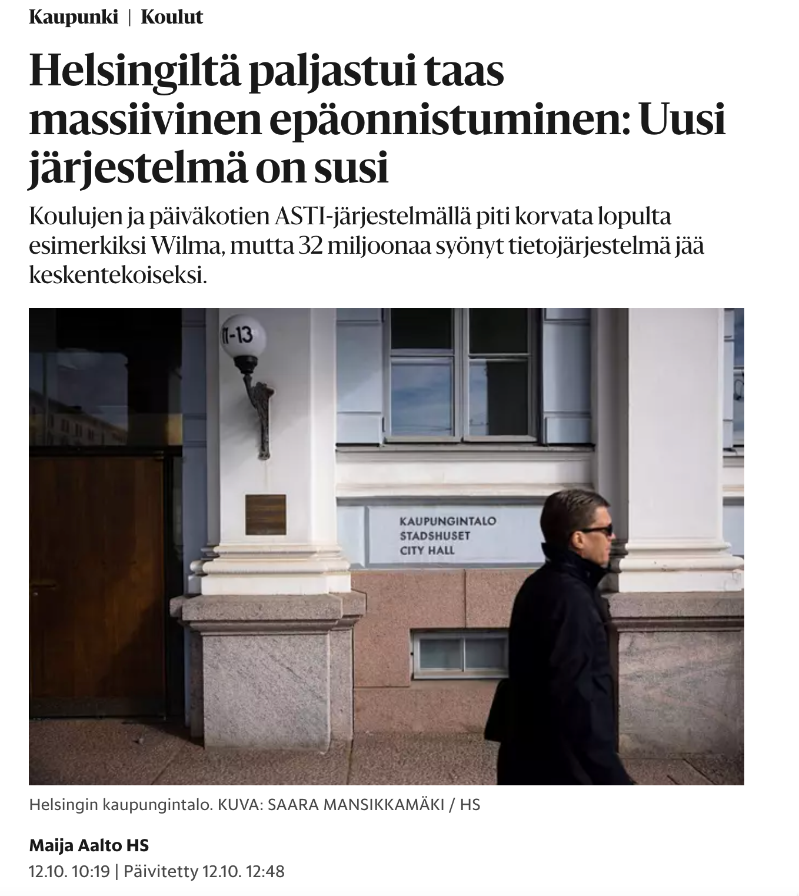
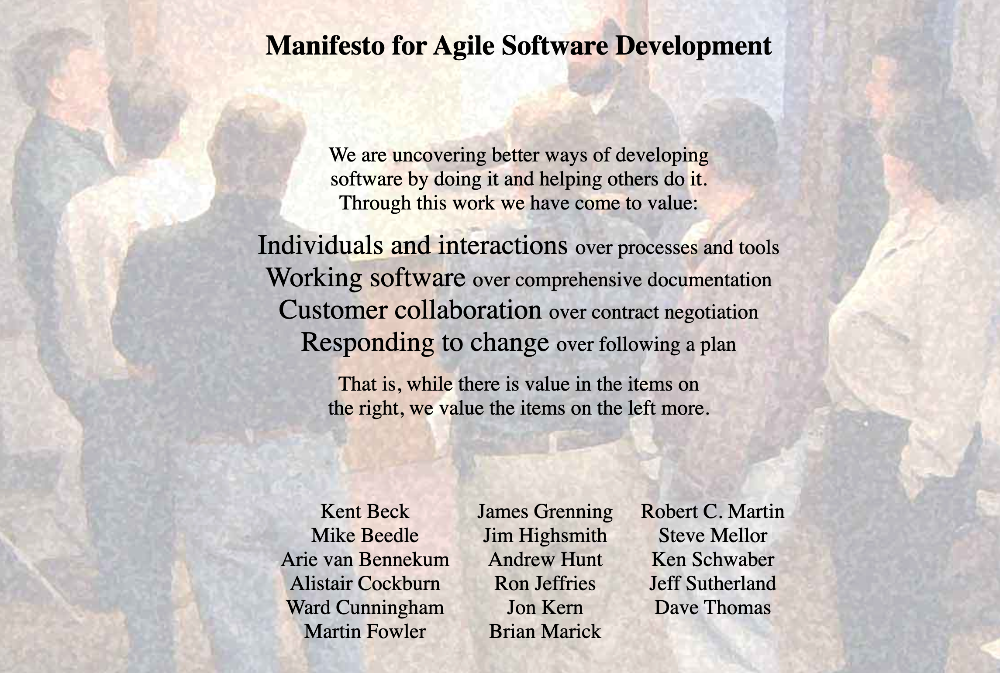

% Ohjelmistotuotanto
% Matti Luukkainen ja ohjaajat Valtteri Kantanen, Hannah Leinson, Riku Rauhala, Ville Saastamoinen
% syksy 2023

#

&nbsp;&nbsp;&nbsp;&nbsp;&nbsp;&nbsp;&nbsp;&nbsp;&nbsp;&nbsp;&nbsp;&nbsp;&nbsp;&nbsp;&nbsp;&nbsp;&nbsp;&nbsp;&nbsp;&nbsp;&nbsp;&nbsp;&nbsp;&nbsp;&nbsp;&nbsp;&nbsp;&nbsp;&nbsp;&nbsp;&nbsp;&nbsp;&nbsp;&nbsp;&nbsp;&nbsp;&nbsp;Luento 1

&nbsp;&nbsp;&nbsp;&nbsp;&nbsp;&nbsp;&nbsp;&nbsp;&nbsp;&nbsp;&nbsp;&nbsp;&nbsp;&nbsp;&nbsp;&nbsp;&nbsp;&nbsp;&nbsp;&nbsp;&nbsp;&nbsp;&nbsp;&nbsp;&nbsp;&nbsp;&nbsp;&nbsp;&nbsp;&nbsp;&nbsp;&nbsp;&nbsp;&nbsp;&nbsp;&nbsp;30.10.2022

# Ohjelmistotuotanto

&nbsp;&nbsp;&nbsp;&nbsp;&nbsp;&nbsp;&nbsp;&nbsp;&nbsp;&nbsp;&nbsp;&nbsp;&nbsp;&nbsp;&nbsp;&nbsp;&nbsp;&nbsp;&nbsp;&nbsp;&nbsp;&nbsp;&nbsp;&nbsp;&nbsp;&nbsp;&nbsp;&nbsp;&nbsp;&nbsp;&nbsp;&nbsp;&nbsp;&nbsp;&nbsp;&nbsp;&nbsp;&nbsp;&nbsp;?

# Ohjelmistotuotanto

Johdanto _ohjelmistotuotantoon_ (engl. software engineering), eli systemaattiseen tapaan tehdä hieman laajempia ohjelmistoja useamman hengen tiimissä ulkoiselle asiakkaalle

. . .

Erityinen paino ns. ketterissä (engl. agile) ohjelmistotuotantomenetelmissä

# Kurssin oppimistavoitteet

Tiedolliset ja tekniset valmiudet toimia _juniorikehittäjän roolissa_ pienessä ohjelmistotiimissä, esim. _ohjelmistotuotantoprojektissa_

. . .

Suoritettuaan kurssin opiskelija

- tuntee ohjelmistoprosessin vaiheet (vaatimusmäärittely, suunnittelu, toteutus ja laadunhallinta)

. . .

- tietää miten vaatimuksia hallitaan ketterässä ohjelmistotuotantoprosessissa

. . .

- ymmärtää suunnittelun, toteutuksen ja testauksen vastuut ja luonteen ketterässä ohjelmistotuotannossa

. . .

- ymmärtää laadunhallinnan perusteet

. . .

- osaa toimia ympäristössä, jossa ohjelmistokehitys tapahtuu hallitusti ja toistettavalla tavalla

# Kurssin rakenne

- Luennot ma ja ti 12-14
  - Ohjelmistotuotantoon liittyvää käsitteistöä ja teoriaa
  - Vierailuluennot (2 viimeistä viikkoa)
    - Hannu Kokko Elisa, Anniina Sallinen Oura, Jami Kousa ja Kasper Hirvikosi Unity, Ville Nordberg Trail Openers, Mikko Tiainen Hogrefe

. . .

- Laskarit

  - teoriaa kertaavat _monivalintatehtävät_, deadline su 23.59
  - versionhallintaa, testaamista ja ohjelmistojen konfigurointia käsittelevät, deadline _maanantaina klo 23:59_

  . . .

  - oletettu kuormittavuus on noin 8 tuntia ensimmäisen kahden viikon aikana, viikolla 3 noin 6 tuntia  ja 4 tuntia sen jälkeen
  - monivalintatehtäviin vastaaminen nopeaa, edellyttää osallistumista luennoille ja/tai viikon materiaalin lukemista

. . .

- Miniprojekti
  - alkaa kurssin 3. viikolla
  - yhdistää teorian ja käytännön

# Miniprojekti

- kurssin viikoilla 3-7
- ryhmätyö: koodataan hiukan, harjotellaan projektinhallintaa sekä eräitä laadunhallintatekniikoita

. . .

- ryhmässä 4-6 opiskelijaa, ryhmillä on myös asiakas, jota tavataan viikoittain
- ensimmäisellä viikolla asiakastapaamiseen tulee varata 90 minuuttia, jälkimmäisillä 30 minuuttia
- kurssin lopussa on miniprojektien yhteinen 2h kestoinen demotilaisuus

. . .

- miniprojekteissa työskentelyyn tulee varata aikaa noin 6 tuntia viikossa

_Kurssin läpäisyn edellytyksenä_ on hyväksytysti suoritettu tai hyväksiluettu miniprojekti

# Miniprojektin hyväksilukeminen

Vähintään kolmen kuukauden työkokemus tiimityönä tehtävästä ohjelmistokehityksestä

Lähetä emailia sen jälkeen kun olet palauttanut viikon 1 tehtävät

# Kurssin arvostelu

Jaossa yhteensä 40 pistettä

- laskarit 10 pistettä
  - monivalintatehtävät 2 pistettä
  - viikoittaiset ohjelmointi/versionhallinta/konfigurointitehtävät 8 pistettä
- miniprojekti 11 pistettä
- koe 18 pistettä
- osallistuminen vierailuluennoille 1 piste (0.33 pistettä per luentokerta)

Arvosanaan 1 riittää 20 pistettä, arvosanaan 5 tarvitaan 36 pistettä.

Läpipääsy edellyttää lisäksi miniprojektin hyväksyttyä suoritusta (tai hyväksilukua) ja vähintään puolia kokeen pisteistä

# Luennot - laskarit - miniprojekti

**Luennoilla** ohjelmistokehityksen teoriaa ja käsitteistöä

- laskarien _monivalintatehtävät_ liittyvät kunkin viikon luentoihin

. . .

Versionhallintaa, konfigurointia, testausta ja ohjelmointia käsittelevien **teknisempien laskarien** aihepiirejä ei paljoa käsitellä luennoilla

. . .

**Miniprojekti** yhdistää luentojen teoria ja laskareissa käsitellyt teknisemmät asiat, ja soveltaa niitä käytännössä

. . .

**Kokeessa** suurin painoarvo teoriassa ja sen soveltamisessa käytäntöön

- laskareiden teknisimpiä asioita ei kokeessa tulla kysymään
- tarkemmin kokeesta kurssin viimeisellä luennolla

# Versionhallinta 1 op

Saat suoritusmerkinnän tekemällä kaikki kurssin versiohallintatehtävät ja suorittamalla hyväksytysti miniprojektin

# Kurssimateriaali

https://ohjelmistotuotanto-hy.github.io/

# Kurssipalaute

. . .

- Kurssipalaute
  - Kurssilla lopussa kerättävän palautteen lisäksi ns. jatkuva palaute https://norppa.helsinki.fi

. . .

- Kurssipalaute **vaikuttaa**
- Edellisen kurssin palautteen "moitteita"

  - Miniprojektien kesto
    - kolmen sprintin sijaan 4 sprinttiä
  - Kokeen arvostelun painoarvo ja ylipäätään merkitys
    - painoarvoa hieman pienennetty (19/40p --> 18/40p)
  - Monivalinnat
    - Poistettu vierailuluennoilta
    - Mahdollisuus korvata _luentopäiväkirjalla_

# Monivalintojen korvaaminen luentopäiväkirjalla

. . .

- Kurssin viikoilla 1-5 viikon luentoja kertaavat monivalinnat (2/40 kurssin pisteistä)

. . . 

- Monivalinnat ovat herättäneet tunteita, en ole itsekään niiden fani
- Hyödyt ovat kiistattomat, kokeet menevät nykyään paremmin kuin monivalintoja edeltävänä aikana

. . .

- Tarjolla vaihtoehto: **viikoittainen luentopäiväkirja**
- Noin A4:n kokoinen omin sanoin tehty yhteenveto viikon luentojen asioista
  - voi olla tehty käsin, joko tekstiä, lista ranskalaisia viivoja tai esim. mind map
  - ei kuitenkaan missään tapauksessa plagiaatti tai ChatGPT:llä generoitu (opintovilppi: käsitellään HY:n prosessin mukaan)

. . .

- Deadline kunkin viikon sunnuntai klo 23:59, lähetetään emailitse matti.luukkainen@helsinki.fi
- Arvostelu, ks kurssimateriaalin osa 0

# Ohjelmistotuotanto engl. software engineering

. . .

The IEEE Computer Society defines software engineering as:

- _The application of a systematic, disciplined, quantifiable approach to the development, operation, and maintenance of software; that is, the application of engineering to software_

# Ohjelmistotuotanto engl. software engineering

The IEEE Computer Society defines software engineering as:

- _Systemaattisen, kurinalaisen ja mitattavissa olevan lähestymistavan soveltaminen ohjelmistojen kehittämiseen, käyttöön ja ylläpitoon, eli "insinöörityön" soveltaminen ohjelmistoihin_

. . .

Lähde _SWEBOK_ eli _Guide to the Software Engineering Body of Knowledge_

- ison komitean yritys määritellä mitä ohjelmistotuotannolla tarkoitetaan ja mitä osa-alueita siihen kuuluu
- uusin versio vuodelta 2014

# Ohjelmistotuotannon osa-alueet

SWEBOK:in mukaan ohjelmistotuotanto jakautuu seuraaviin osa-alueisiin:

- Software requirements eli **vaatimusmäärittely**
- Software design eli **suunnittelu**
- Software construction eli **toteutus/ohjelmointi**
- Software testing eli **testaus**
- Software maintenance eli **ylläpito**

. . .

- Software configuration management eli **konfiguraatiot**
- Software engineering management eli **ihmisten johtaminen**
- Software engineering process eli **ohjelmistotuotantoprosessi**
- Software engineering tools and methods eli **työkalut**
- Software quality eli **laadunhallinta**

Näiden osa-alueiden läpikäynti on myöskin tämän kurssin tavoite

# Ohjelmiston elinkaari (software lifecycle)

Riippumatta tyylistä ja tavasta, jolla ohjelmisto tehdään, käy ohjelmisto läpi seuraavat _vaiheet_

- Vaatimusten analysointi ja määrittely
- Suunnittelu
- Toteutus
- Testaus
- Ohjelmiston ylläpito ja evoluutio

. . .

Vaiheista muodostuu ohjelmiston "elinkaari"

. . .

Käytetty **ohjelmistotuotantoprosessi** määrittelee miten vaiheet suhtautuvat toisiinsa

. . .

Eri vaiheiden sisältöön palaamme myöhemmin tarkemmin

# Alussa (ja osin edelleen) code'n'fix

Historian alkuaikoina laitteet maksoivat paljon, ohjelmat olivat laitteistoihin nähden "triviaaleja"

- ohjelmointi konekielellä
- sovelluksen käyttäjä ohjelmoi itse ohjelmansa

. . .

Vähitellen ohjelmistot alkavat kasvaa ja kehitettiin korkeamman tason ohjelmointikieliä (Fortran, Cobol, Algol)

- sovellusalue laajenee monille elämänaloille

. . .

Pikkuhiljaa homma alkaa karata käsistä:

- budjetit ylittyivät ja projektit myöhästyivät aikatauluista
- ohjelmistot olivat tehottomia, niiden laatu oli huono ja ne eivät toimineet käyttäjien tarpeiden mukaan
- koodin ylläpito ja laajentaminen oli vaikeaa
- usein ohjelmistoja ei hyvistä aikeista huolimatta saatu ollenkaan toimitettua

# Ohjelmistokriisi

Termi Software crisis lanseerataan kesällä 1968

- In essence, it refers to the difficulty of writing correct, understandable, and verifiable computer programs.

. . .

Edsger Dijkstra:

- **as long as there were no machines, programming was no problem at all**

. . .

- when we had a few weak computers, programming became a mild problem

. . .

- **now we have gigantic computers, programming has become an equally gigantic problem**.

# Kriisi ei ole ohi...

{ width=400 }

# Software development as Engineering

. . .

Termi **software engineering** määritellään ensimmäistä kertaa 1968:

- _The establishment and use of sound engineering principles in order to obtain economically software that is reliable and works efficiently on real machines_

  . . .

Ajatus siitä, että ohjelmistojen tekemisen tulisi olla kuin mikä tahansa muu insinöörityö

- ensin rakennettava artefakti _määritellään_ (requirements)
- ja _suunnitellan_ (design) aukottomasti
- tämän jälkeen _rakentaminen_ (construction) on melko suoraviivainen vaihe

# Vesiputousmalli

Winston W. Royce: Management of the development of Large Software, 1970

Sivulla 2 Royce esittelee yksinkertaisen prosessimallin, jossa elinkaaren vaiheet suoritetaan lineaarisesti peräkkäin:

{ width=440 }

# Vesiputousmalli Roycen artikkelista

{ width=440 }

# Vesiputousmallin suosion taustaa

Vesiputousmalli saavutti nopeasti suosiota

Yhdysvaltain puolustusministerö rupesi vaatimaan kaikilta alihankkijoiltaan vesiputousmallin noudattamista

- Standardi DoD STD 2167

. . .

Muutkin ohjelmistoja tuottaneet tahot ajattelivat, että koska DoD vaatii vesiputousmallia, tapa kannattaa omaksua itselleen

# Vesiputousmallin oletuksia

Vesiputousmalli perustuu vahvasti siihen, että _eri vaiheet ovat erillisten tuotantotiimien tekemiä_

- Tämän takia kunkin vaiheen tulokset _dokumentoidaan tarkoin_

. . .

_Vaiheet tehdään peräkkäin_

- esim. tekninen suunnittelu aloitetaan kun vaatimusmäärittely on valmis

. . .

Vesiputousmallin mukainen ohjelmistoprosessi on yleensä etukäteen _tarkkaan suunniteltu, resursoitu ja aikataulutettu_

. . .

**Vesiputousmallin mukainen ohjelmistotuotanto ei ole osoittautunut erityisen onnistuneeksi**

# Vesiputousmallin ongelmia

Asiakkaan _vaatimukset muuttuvat_ usein matkan varrella:

- Asiakas ei tiedä tai osaa sanoa mitä haluaa/tarvitsee
- Asiakkaan tarve muuttuu projektin kuluessa
- Asiakas alkaa haluta muutoksia kun näkee lopputuotteen

. . .

Vaatimusmäärittelyn, suunnittelun ja toteutuksen erottaminen ei järkevää

- Ohjelmaa on mahdotonta suunnitella siten, että toteutus on suoraviivaista
- Toteutusteknologiat vaikuttavat suuresti määriteltyjen ominaisuuksien hintaan
- Osa suunnittelusta tapahtuu pakosti vasta ohjelmoitaessa

. . .

_Lopuksi tapahtuva laadunhallinta_ paljastaa ongelmat liian myöhään

- Korjaukset mahdollisesti kalliita: voi paljastua ongelmia jotka pakottavat muuttamaan ohjelmiston vaatimuksia

# Vesiputous oli väärinymmärrys

Paradoksaalista kyllä vesiputousmallin isänä pidetty Royce **ei suosittele** artikkelissaan suoraviivaisen lineaarisen mallin käyttöä

. . .

Royce esittelee lineaarisen vesiputousmallin **sivulla 2**, mutta toteaa että se **ei sovellu** monimutkaisiin ohjelmistoprojekteihin

. . .

Roycen mukaan 

- ensin tulee tehdä prototyyppi
- ja siitä saatujen kokemusten valossa suunnitellaan ja toteutetaan lopullinen ohjelmisto

# Roycen kahden iteraation malli

{ width=400 }

# Iteratiivinen ohjelmistokehitys

Vesiputousmallin ongelmiin reagoinut _iteratiivinen_ tapa tehdä ohjelmistoja alkoi yleistyä 90-luvulla

- mm. spiraalimalli, prototyyppimalli, Rational Unified Process

. . .

Interatiivisessa ohjelmistokehityksessä

- ohjelmistotuotanto jaetaan jaksoihin, eli _iteraatioihin_
- jokaisen iteraation aikana määritellään, suunnitellaan toteutetaan ja testataan ohjelmistoa
- eli ohjelmisto kehittyy vähitellen (inkrementaalisesti)

# Iteratiivinen ohjelmistokehitys

{ width=400 }

. . .

- asiakasta tavataan jokaisen iteraation välissä
- asiakas näkee sen hetkisen version ohjelmasta ja pystyy vaikuttamaan seuraavien iteraatioiden kulkuun

# Iteratiivinen ohjelmistokehitys ei ole uusi keksintö

Yhdysvaltojen puolustusministeriön 2000 julkaisema standardi (MIL-STD-498) alkaa suositella iteratiivista ohjelmistoprosessia:

- There are two approaches, evolutionary (_iterative_) and single step (_waterfall_), to full capability. An _evolutionary approach is preferred_...

. . .

Iteratiivinen ohjelmistokehitys on paljon vanhempi idea kun vesiputosmalli

- esim. NASA:n ensimmäisen amerikkalaisen avaruuteen vieneen Project Mercuryn ohjelmisto kehitettiin iteratiivisesti
- avaruussukkuloiden ohjelmisto tehtiin vesiputousmallin valtakaudella, mutta iteratiivisesti
  - 8 viikon iteraatioissa, 31 kuukaudessa

. . .

Roycen artikkelikin (vuonna 1970) ehdotti _kahden iteraation_ menetelmää ohjelmistojen tekemiseen

#  Ketterien menetelmien synty...

Perinteisissä prosessimalleissa korostettiin

- huolellista projektisuunnittelua
- formaalia laadunvalvontaa
- yksityiskohtaisia analyysi- ja suunnittelumenetelmiä
- täsmällistä, tarkasti ohjattua ohjelmistoprosessia

. . .

_Tukivat erityisesti laajojen, pitkäikäisten ohjelmistojen kehitystyötä_

- pienten ja keskisuurten ohjelmistojen tekoon turhan jäykkiä

. . .

Pyrittiin työtä tekevän yksilön merkityksen minimoimiseen

- yksilö on "tehdastyöläinen", joka voidaan helposti korvata toisella ja tällä ei ole ohjelmiston kehittämiseen vaikutusta

# Ketterien menetelmien synty

Ristiriita/turhauma synnytti joukon **ketteriä prosessimalleja** (agile)

- korostivat itse ohjelmistoa sekä ohjelmiston asiakkaan ja toteuttajien merkitystä yksityiskohtaisen suunnittelun ja dokumentaation sijaan

. . .

- Useita samanhenkisiä menetelmiä 90-luvun luppupuolelta lähtien

# Ketterä manifesti 2001

. . .

{ width=400 }

# Ketterä manifesti 2001

We are uncovering better ways of developing software by doing it and helping others do it.

Through this work we have come to value:

- **Individuals and interactions** over processes and tools
- **Working software** over comprehensive documentation
- **Customer collaboration** over contract negotiation
- **Responding to change** over following a plan

That is, while there is value in the items on the right, we value the items on the left more

. . .

Manifestin laativat ja allekirjoittivat 17 ketterien menetelmien varhaista pioneeria, mm. Kent Beck, Robert Martin, Ken Schwaber ja Martin Fowler

# Ketterät periaatteet, osa 1

. . .

Our highest priority is to satisfy the customer through **early and
continuous delivery of valuable software**

. . .

**Deliver working software frequently**, from a couple of weeks to
a couple of months, with a preference to the shorter timescale

. . .

Business people and developers must **work together daily** throughout the project

. . .

The most efficient and effective method of conveying information to and within a development team is **face-to-face** conversation

. . .

**Welcome changing requirements**, even late in development. Agile processes harness change for the customer's competitive advantage

# Ketterät periaatteet, osa 2

Build projects around motivated individuals. Give them the environment and support they need, and **trust them to get the job done**

. . .

The best architectures, requirements, and designs emerge from **self-organizing teams**

. . .

At regular intervals, the **team reflects on how to become more effective**, then tunes and adjusts its behavior accordingly

. . .

**Simplicity** – the art of maximizing the amount of work not done – is essential

. . .

Continuous attention to **technical excellence and good design** enhances agility

. . .

Agile processes promote **sustainable development**. The sponsors, developers, and users should be able to maintain a constant pace indefinitely

# Ketterät menetelmät

Sateenvarjotermi useille ketterille prosessimalleille

- Näistä tunnetuimpia ovat Scrum ja eXtreme programming eli XP
- Molempiin, erityisesti Scrumiin tutustutaan kurssin aikana

. . .

Ketterä ohjelmistotuotanto on ottanut vaikutteita myös Toyota production systemin taustalla olevasta _lean-ajattelusta_

Viime vuosina syntynyt joukko "lean-menetelmiä"

- Kanban
- Scrumban

. . .

... sekä laajan mittakaavan leaniin ja ketterään kehitykseen tarkoitettuja menetelmiä kuten SaFe

Myös nämä kuuluvat kurssin aihepiiriin

# Viikon 1 laskarit

. . .

Ohjelmistokehityksen käytännön työkaluja

- Versionhallinta: Git
- Automatisoitu testaus: Unittest
- Projektin riippuvuuksienhallinta ja "buildaus": Poetry
- CI- ja build-palvelinohjelmisto: Github Action

Tavoitteena mahdollistaa hallittu- ja toistettavissa oleva ohjelmistokehitys

. . .

_Deadline maanantaina klo 23:59_

**Muista myös teoriaa kertaavat monivalintatehtävät, deadline sunnuntaina klo 23:59**
