% Ohjelmistotuotanto
% Matti Luukkainen ja ohjaajat Valtteri Kantanen, Hannah Leinson, Riku Rauhala, Ville Saastamoinen
% syksy 2023

#

&nbsp;&nbsp;&nbsp;&nbsp;&nbsp;&nbsp;&nbsp;&nbsp;&nbsp;&nbsp;&nbsp;&nbsp;&nbsp;&nbsp;&nbsp;&nbsp;&nbsp;&nbsp;&nbsp;&nbsp;&nbsp;&nbsp;&nbsp;&nbsp;&nbsp;&nbsp;&nbsp;&nbsp;&nbsp;&nbsp;&nbsp;&nbsp;&nbsp;&nbsp;&nbsp;&nbsp;&nbsp;Luento 2

&nbsp;&nbsp;&nbsp;&nbsp;&nbsp;&nbsp;&nbsp;&nbsp;&nbsp;&nbsp;&nbsp;&nbsp;&nbsp;&nbsp;&nbsp;&nbsp;&nbsp;&nbsp;&nbsp;&nbsp;&nbsp;&nbsp;&nbsp;&nbsp;&nbsp;&nbsp;&nbsp;&nbsp;&nbsp;&nbsp;&nbsp;&nbsp;&nbsp;&nbsp;&nbsp;&nbsp;31.10.2022

# Kurssipalaute

- Kurssipalaute
  - Kurssilla lopussa kerättävän palautteen lisäksi ns. jatkuva palaute https://coursefeedback.helsinki.fi

# Vesiputousmallin suurimmat ongelmat

. . .

- Vaatimukset mahdotonta määritellä tyhjentävästi heti alussa
  - asiakas ei ymmärrä vielä alussa mitä haluaa
  - bisnesympäristö muuttuu projektin kuluessa

. . .

- Suunnittelu sillä tasolla, että ohjelmointi on suoraviivainen "rakennusvaihe" on mahdotonta
  - ohjelmointi on osa suunnitteluprosessia, ohjelmakoodi on tuotteen lopullinen suunnitelma

. . .

- Suunnittelu taas on teknisesti haastavaa, riskejä sisältävää toimintaa

. . .

- Lopussa tehtävä testaus paljastaa ongelmat liian myöhään
  - onglemien korjaaminen voi edellyttää kalliita muutoksia

# Ohjelmiston tuottaminen ei ole kontrolloitu prosessi

- 90-luvun iteratiiviset prosessimallit korjaavat monia edellisen kalvon epäkohdista
- Olivat edelleen tarkkoihin etukäteissuunnitelmiin perustuvia
  - Tarkka projektisuunnitelma ja sen noudattaminen
  - Selkeä roolijako: projektipäälliköt, analyytikot, arkkitehdit, ohjelmoijat, testaajat

. . .

- eli ne olettivat että ohjelmistotuotanto on jossain määrin _kontrolloitavissa oleva prosessi_

# Ketterien menetelmien perusolettamuksia

. . .

- Useimmat ohjelmistoprojektit ovat laadultaan uniikkeja
  - **Vaatimukset erilaiset** kuin millään jo tehdyllä ohjelmistolla
  - **Uusi tekijätiimi**, varustettu omanlaisilla kompetensseilla ja persoonallisuuksilla
  - **Toteutusteknologiat kehittyvät** tehdään todennäköisesti tavalla, joka ei ole kaikille tuttu

. . .

- Järkevää lähteä oletuksesta että kyseessä ei ole _kontrolloitu prosessi_, joka voidaan tarkkaan etukäteen aikatauluttaa ja suunnitella

. . .

- Parempi ajatella _tuotekehitysprojektina_, näiden kontrollointiin sopii paremmin _empiirinen prosessi_ jonka periaatteina
  - _transparency_ läpinäkyvyys
  - _inspection_ tarkkailu
  - _adaption_ mukauttaminen

# Ketterien menetelmien perusolettamuksia

- Tekijät yksilöitä: toimivat paremmin kun heihin luotetaan ja annetaan tiimille vapaus organisoida itse toimintansa

. . .

- Oletuksena että perinteinen command-and-control ja jako eri vastuualueisiin ei tuota optimaalista tulosta

- "The whole team"-periaate: tiimi kollektiivina vastuussa aikaansaannoksesta

. . .

Eilen käsitelty _ketterän manifesti_ heijastelee näitä olettamuksia

. . .

Ovatko nämä valideja olettamuksia?

# Scrum

- Tutustumme kurssillat Scrumiin, joka on tällä hetkellä selvästi suosituin ketterä menetelmä/prosessimalli

. . .

- Kehittäjiensä mukaa Scrum on
  - menetelmäkehys
  - monimutkaisten ongelmien ratkaisuun
  - tuottavalla, luovalla ja maksimaalisen arvoa tuottavalla tavalla

. . .

- Scrum on:
  - kevyt (lightweight)
  - helppo ymmärtää
  - mutta **äärimmäisen vaikea hallita** (extremely difficult to master)

# Scrum lyhyesti

- Iteratiivinen ja inkrementaalinen menetelmä (tai kehittäjiensä mukaan framework eli menetelmäkehys)
- Kehitys tapahtuu 1-4 viikon iteraatioissa, joita Scrumissa kutsutaan _sprinteiksi_

. . .

- _Scrum-tiimi_ koostuu 3-9:stä kehittäjästä
- _Scrum master_ toimii tiimin apuna ohjaten mm. prosessin noudattamisessa sekä toimien rajapintana yrityksen hallintoon
- _Product owner_ eli tuotteen omistaja hallinnoi projektin backlogia
  - _backlog_ sisältää priorisoidussa järjestyksessä projektissa toteutettavan ohjelmiston vaatimukset/toiminnot

. . .

- Jokaisen sprintin alussa tiimi valitsee projektin backlogista sprintin aikana toteutettavat vaatimukset
- Sprintin aikana Scrum-tiimi toteuttaa itseorganisoidusti sprintiin valitut vaatimukset lopputuloksena vaatimusten osalta toimiva ohjelmisto

# Scrum kuvana

{ width=440 }

# Scrum: roles, artifacts and events

Terminologiaa

- Scrum määrittelee 3 erilaista roolia:
  - Kehittäjä
  - Scrum master
  - Product owner

. . .

- Scrumiin kuuluvat artefaktit eli ”konkreettiset asiat” ovat
  - Product backlog eli projektin kehitysjono
  - Sprint backlog eli sprintin tehtävälista
  - Työn alla olevan ohjelmiston uudet versiot (product increment)

. . .

- Scrumissa tekeminen rytmittyy sprintteihin eli 1-4 viikon mittaisiin iteraatioihin

. . .

- Sprintteihin kuuluu muutamia standardipalavereja (events):
  - Sprintin suunnittelupalaveri
  - Daily scrum -palaverit
  - Sprintin katselmointi
  - Retrospektiivi

# Product backlog

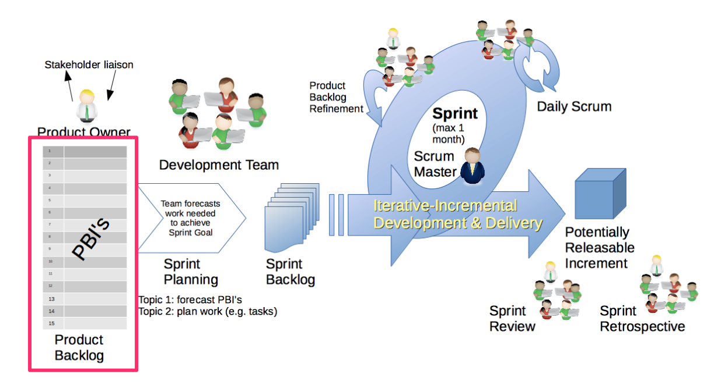{ width=440 }

# Product backlog

- Priorisoitu lista asiakkaan tuotteelle asettamista _vaatimuksista_
  - asiakkaan tasolla olevia _arvoa tuottavia_ toiminnallisuuksia, kirjattuna asiakkaan ymmärtämällä kielellä

. . .

- Priorisoidun listan kärkipään vaatimukset valitaan toteutettavaksi seuraaviin sprintteihin
  - kirjattu tarkemmin kuin backlogin häntäpään vaatimukset

. . .

- Vaatimukset ovat usein _estimoituja_ eli toteutuksen vaatima työmäärä on arvioitu
  - Työmääräarviot tekee kehittäjätiimi

. . .

- Scrum ei määrittele missä muodossa backlog ja siinä olevat vaatimukset esitetään
  - nykyään käytetään usein _user story_ -formaattia

# Product owner

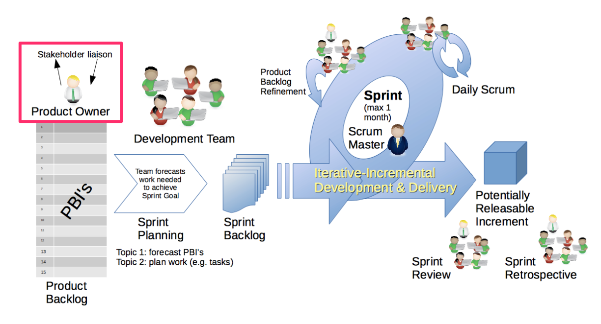{ width=440 }

# Product owner

- Scrumin mukaan kuka vaan voi milloin tahansa lisätä backlogiin vaatimuksia
- Backlogia priorisoi ainoastaan _product owner_ eli tuotteen omistaja

. . .

- Product owner on yksittäinen henkilö
  - Priorisointiin voi toki olla vaikuttamassa useampikin henkilö
  - Product owner tekee lopulliset päätökset prioriteettien suhteen

. . .

- Product owner on vastuussa backlogista
  - Varmistaa että kehittäjätiimi ymmärtää toteutettavaksi valitut vaatimukset
  - Priorisoi vaatimukset maksimoiden asiakkaan tuotteesta saaman hyödyn/arvon

# Scrum master

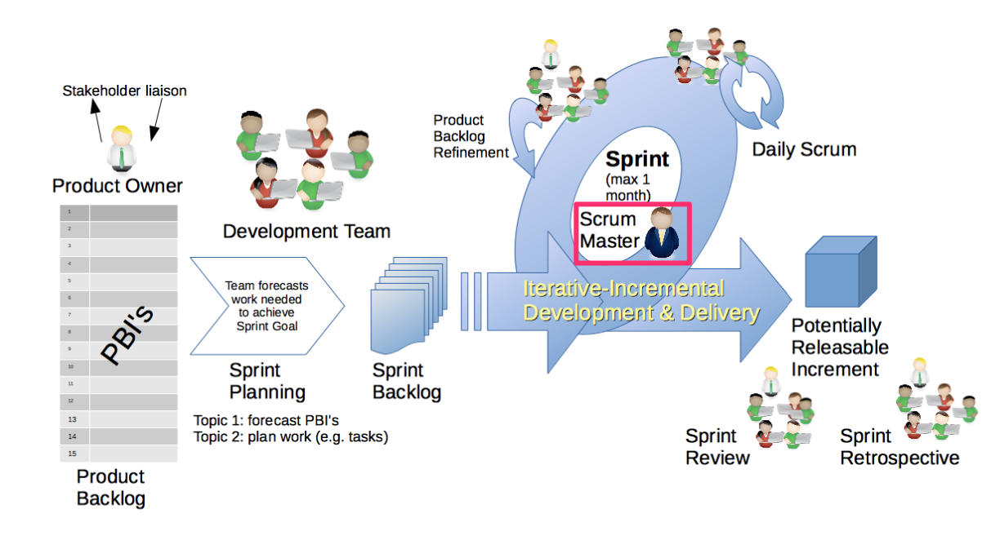{ width=440 }

# Scrum master

- Tiimeillä on _scrum master_, eli henkilö joka huolehtii siitä että ohjelmistokehitys etenee sujuvasti

. . .

- Ei perinteinen projektipäällikkö vaan _servant-leader_
  - järjestää Scrumiin liittyvät palaverit
  - huolehtii että Scrumia noudatetaan järkevällä tavalla
  - opastaa hyvien käytänteiden noudattamisessa
  - rohkaisee ja auttaa tiimiä itseorganisoitumisessa

. . .

- Pyrkii poistamaan kehitystyön **esteitä**
  - voi olla tiimistä riippumaton asia, jonka poistamiseksi scrum master joutuu neuvottelemaan yrityksen hallinnon kanssa
  - voi liittyä ryhmän työtapoihin, tällöin scrum master opastaa ryhmää toimimaan siten, että este poistuu

. . .

- Scrum master tekee kaikkensa, jotta tiimillä olisi optimaaliset olosuhteen kehittää tuotetta

# Kehittäjätiimi

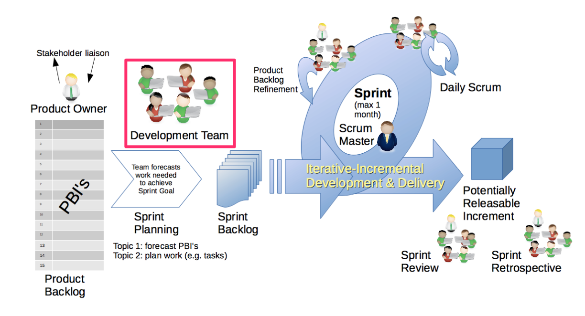{ width=440 }

# Kehittäjätiimi

- Kehittäjätiimi koostuu noin 3-9:stä henkilöstä, kaikista käytetään nimikettä developer
  - vaikka kaikilla nimike developer, voivat jotkut tiimin jäsenistä ovat erikoistuneet omaan osa-alueeseensa

. . .

- koko tiimi kantaa aina yhteisen vastuun kehitystyöstä

. . .

- Oletuksena on että tiimin jäsenet työskentelevät tiimissä 100%:lla työajalla

. . .

- Tiimin tulee oletusarvoisesti työskennellä samassa paikassa, mieluiten yhteisessä tiimille varatussa avokonttorissa
  - COVID ja sen jälkeinen hybridityöskentely aiheuttaneet haasteita...

# Kehittäjätiimi

- Tiimi on _cross-functional_, eli sen tulisi sisältää kaikki tarvittava osaaminen järjestelmän suunnitteluun, toteuttamiseen ja testaamiseen

. . .

- Kehitystiimiä ei johdeta ulkopuolelta
  - päättää mihin tavoitteisiin se kussakin sprintissä sitoutuu, eli miten paljon vaatimuksia backlogilta valitaan sprintiin
  - päättää myös (tiettyjen reunaehtojen puitteissa) itse miten se sprintin tavoiteen toteuttaa

. . .

- Tiimi on siis _itseorganisoituva_ (self organizing)

# Sprintti

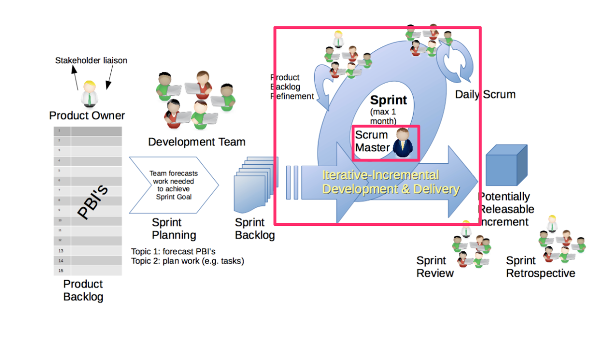{ width=440 }

# Sprintti

- Scrumissa kehitystyö siis jakautuu 1-4 viikon mittaisiin iteraatioihin eli sprintteihin
  - nykyään suosituin sprintin pituus lienee 2 viikkoa
- Sprintti on _time-boxed_, sitä ei missään olosuhteissa pidennetä

. . .

- Jokaisen sprintin alussa tiimi valitsee projektin backlogista sprintin aikana toteutettavat vaatimukset
  - Backlog on priorisoitu ja vaatimukset valitaan aina priorisoidun listan kärjestä
  - Product ownerin asettama prioriteettijärjestys määrää missä missä _järjestyksessä_ asioita toteutetaan

. . .

- Tiimi valitsee sprinttiin ainoastaan sen verran toteutettavaa minkä valmistumiseen se uskoo kykenevänsä sitoutumaan

. . .

- Sprintin aikana scrum-tiimi toteuttaa _itseorganisoidusti_ sprinttiin valitut ohjelmiston ominaisuudet
- Sprintin aikana tiimille ei esitetä uusia vaatimuksia

. . .

- Sprintin lopuksi tuotteesta on oltava olemassa _toimiva versio_ (potentially shippable product increment)

# Definition of done

- Jokaisessa sprintissä lopputuloksena toimiva, valmiiksi tehty osa ohjelmistoa

. . .

- Scrumissa on määriteltävä projektitasolla _definition of done_: mitä tarkoittaa, että jokin vaatimus on toteutettu valmiiksi

. . .

- määritellään yleensä tarkoittamaan sitä, että vaatimus on
  - _analysoitu, suunniteltu, ohjelmoitu, testattu, testaus automatisoitu, dokumentoitu, integroitu muuhun ohjelmistoon ja viety tuotantoympäristöön_

. . .

- Jos Sprintissä on toteutettu joitain vaatimuksia puutteellisesti DoD:in kannalta, niitä ei tule raportoida valmiina

. . .

- Jos sprintin aikana osoittautuu että tiimi ei ehdi toteuttamaan kaikkia vaatimuksia _laadusta ei tingitä_
  - osa vaatimuksista jätetään seuraavaan sprinttiin

# Sprintin suunnittelu

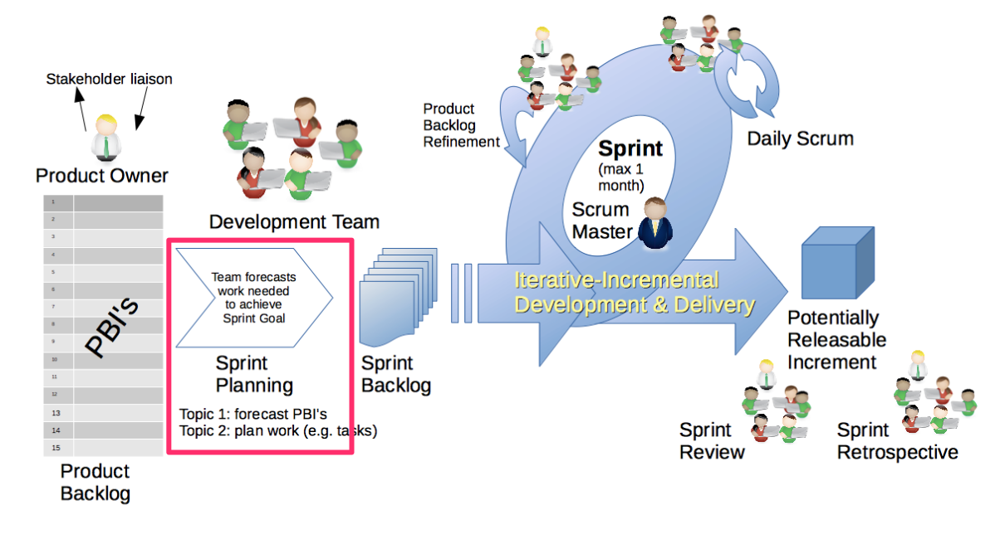{ width=440 }

# Sprintin suunnittelu

- Ennen jokaista sprinttiä järjestetään sprintin _suunnittelukokous_ eli Sprintin suunnittelu
- Kokouksella kaksi tavoitetta, Scrumin sanoin _aiheetta_

. . .

- Ensimmäisen aihe on selvittää **mitä** sprintin aikana tehdään
  - Product owner esittelee product backlogin kärjessä olevat vaatimukset
  - Tiimin tulee olla selvillä siitä, mitä vaatimuksilla tarkoitetaan
  - Tiimi arvioi kuinka monta backlogin vaatimuksista se kykenee sprintin aikana toteuttamaan

# Sprintin suunnittelu

- Suunnittelukokouksen toisena aiheena on selvittää **miten** sprintin tavoitteet saavutetaan

. . .

- Tämä yleensä edellyttää että tiimi suunnittelee toteutettavaksi valitut vaatimukset tarvittavalla tasolla
  - Aikaansaannoksena on usein lista teknisistä _tehtävistä_ (task), jotka sprintin aikana on toteutettava

. . .

- Suunnittelun aikana identifioidut tehtävät kirjataan _sprintin backlogiin_ eli sprintin tehtävälistaan

. . .

Palaamme sprintin suunnitteluun tarkemmin ja konkreettisten esimerkkien kanssa ensi viikolla

# Sprintin suunnittelu: *product backlogilta sprint backlogille*

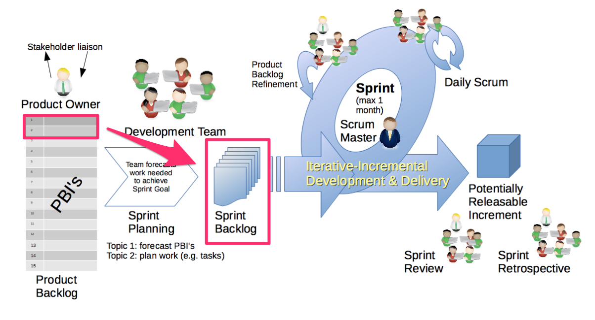{ width=440 }

# Daily scrum – päiväpalaveri

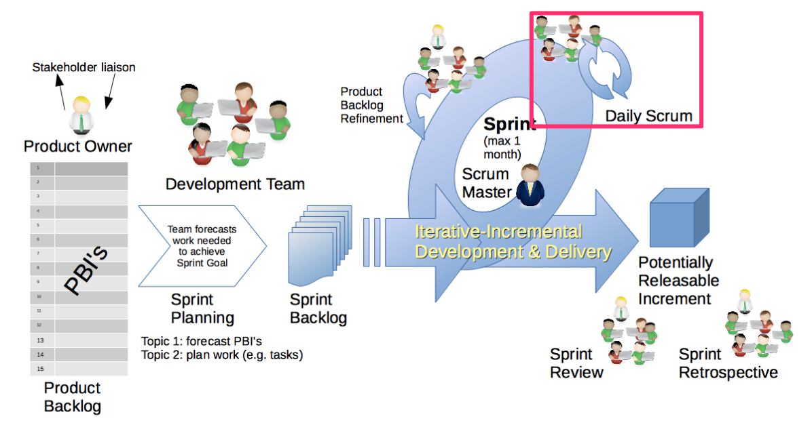{ width=440 }

# Daily scrum – päiväpalaveri

- Jokainen päivä sprintin aikana aloitetaan _daily scrumilla_ eli korkeintaan 15 minuutin mittaisella palaverilla
- Aina samaan aikaan, samassa paikassa, kaikkien kehittäjien oltava paikalla

. . .

- Jokainen tiimin jäsen vastaa vuorollaan kolmeen kysymykseen
  - Mitä sain aikaan edellisen tapaamisen jälkeen?
  - Mitä aion saada aikaan ennen seuraavaa tapaamista?
  - Mitä esteitä etenemiselläni on?

. . .

- Kuka tahansa saa olla seuraamassa daily scrumia, mutta vain tiimin jäsenillä on puheoikeus

. . .

- Palaverin on tarkoitus olla lyhyt, muu keskustelu ei sallittua
- Jos jollakin on ongelmia, scrum master keskustelee asianomaisen kanssa daily scrumin jälkeen

. . .

- Jos muuhun palaverointiin tarvetta, tulee palaverit järjestää daily scrumista erillään

# Sprintin katselmointi

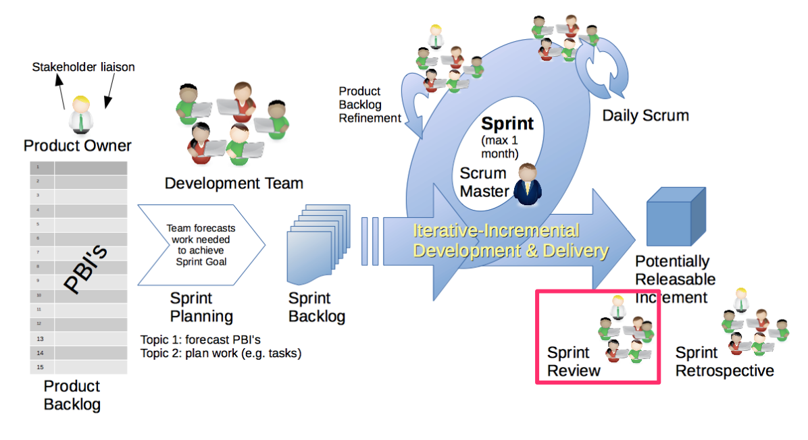{ width=440 }

# Sprintin katselmointi

- Sprintin päätteeksi järjestetään _sprint review_ eli katselmointi
- Katselmointiin voi osallistua kuka tahansa

. . .

- Tiimi esittelee sprintin aikaansaannoksia
  - tarkastellaan/demotaan toteutettua toimivaa ohjelmistoa

. . .

- Scrum master huolehtii, että ainoastaan definition of donen mukaisesti toteutetut vaatimukset demotaan

. . .

- Product owner varmistaa, mitkä vaatimuksista toteutettiin hyväksyttävällä tavalla
- Ne vaatimukset joita ei hyväksytä toteutetuksi siirretään takaisin product backlogiin

# Sprintin katselmointi

- Katselmoinnin aikana kuka tahansa saa antaa palautetta tuotteesta ja esim. ehdottaa uusia vaatimuksia lisättäväksi product backlogiin
- Katselmointi aiheuttaa usein myös tarpeen product backlogin uudelleenpriorisoimiseen

# Retrospektiivi

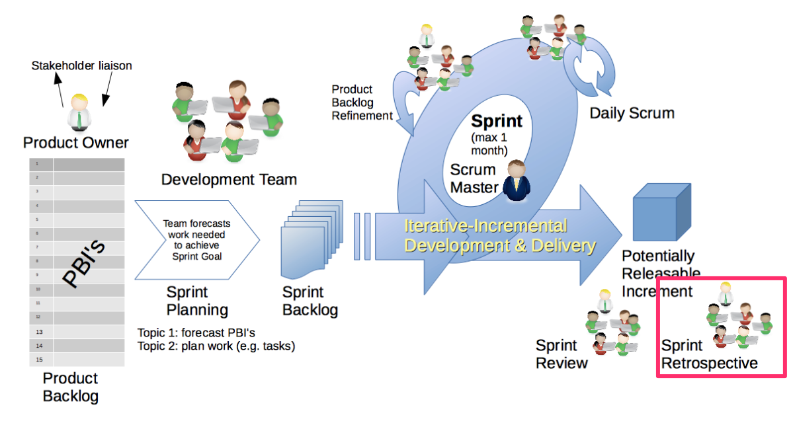{ width=440 }

# Retrospektiivi

- _Retrospektiivi_ on sprintin katselmoinnin ja seuraavan sprintin alun välissä pidettävä palaveri, jonka aikana tiimi tarkastelee omaa työskentelyprosessiaan

. . .

- Identifioidaan mikä meni hyvin ja missä asioissa on parantamisen varaa
- Mietitään ratkaisuja ongelmakohtiin, joita pyritään korjaamaan seuraavan sprintin aikana

# Retrospektiivi: ohtuprojektin tyylinäyte

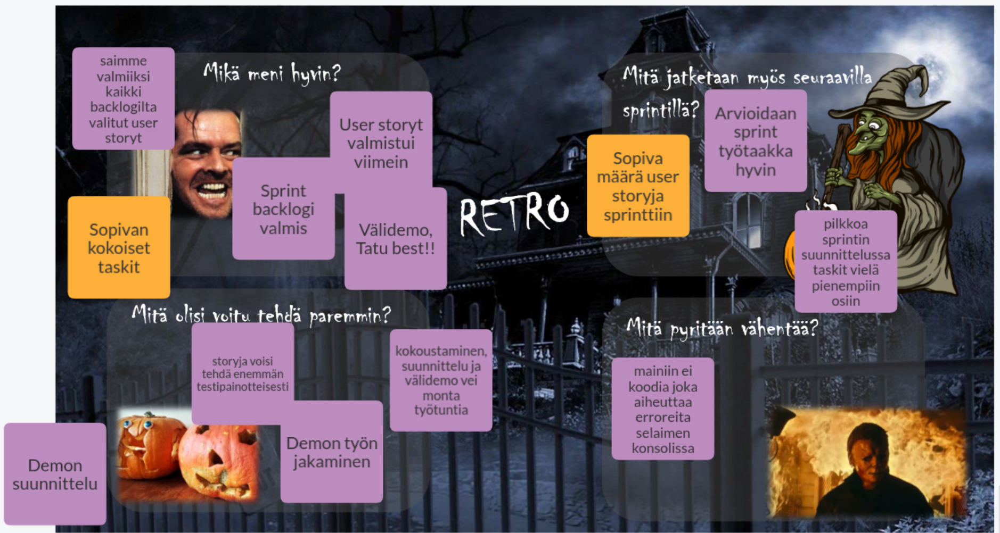{ width=440 }

# Transparency - inspect - adapt

- Scrumin taustaperiaatteet ovat
  - _transparency_ (läpinäkyvyys)
  - _inspection_ (tarkkailu)
  - _adaption_ (mukauttaminen)

. . .

- Asioiden läpinäkyvyys mahdollistaa niiden jatkuvan tarkkailun
- ja sen seurauksena toimintatapoja ja kehitettävää tuotetta on mahdollista mukauttaa

. . .

- Läpinäkyvyys: backlogit, daily scrum, definition of done, sprintin katselmointi, product increment...

. . .

- Lyhyt kehityssykli mahdollistaa sekä tuotteen että toimintatapojen nopean inkrementaalisen parantamisen
  - backlogia uudelleenpriorisoidaan ja muokataan palautteen sekä opitun perusteella
  - retrospektiivi kannustaa tiimiä jatkuvasti parantamaan työprosessiaan

# Transparency - inspect - adapt

{ width=440 }

# Scrumin arvot

- Scrum sisältää joukon _arvoja_ joiden noudattamista se pitää oleellisena: _commitment, focus, courage, respect_

. . .

- tiimin tulee olla _sitoutunut_ (commitment) yhteisen tavoitteen saavuttamiseksi

. . .

- ja _fokusoitua_ (focus) oikeiden asioiden tekemiseen

. . .

- tulee olla _rohkeutta_ (courage) tehdä päätöksiä ja kohdata myös vaikeimpia asioita
  - tulee olla avoimia sekä onnistumisten että ongelmien suhteen

. . .

- oleellista on _kunnioittaa_ (respect) koko ajan kaikkia kehitystiimin jäseniä sekä ohjelmiston sidosryhmiä

# Scrumin tehokas soveltaminen

- Jotta Scrum toimisi _tehokkaasti_, tarvitaan sen soveltamiseen sopiva asenne ja orientaatio, eli on noudatettava Scrumin arvoja

. . .

- Scrumin tekemisen ei ole tarkoitus olla ainoastaan pelisäänöjen orjallista noudattamista

. . .

- Scrumin inspect-and-adapt (tarkkaile ja mukauta) -luonne ohjaa siihen, tiimien on koko ajan mukautettava toimintaansa

. . .

- *Tiimien optimaalisen toiminnan kannalta on joskus parempi toimia jopa joidenkin Scrumin ohjeiden vastaisesti*

# Scrumin ongelmat

- Scrum on osoittautunut monin paikoin paremmaksi tavaksi ohjelmistojen tuottamiseen kuin vesiputousmalli tai muut suunnitelmavetoiset mallit

. . .

- Yleinen ratkaisu ohjelmistotuotannon ongelmiin se ei ole
- Scrumin käytön yleistyessä myös epäonnistuneiden Scrum-projektien määrä kasvaa

. . .

- Yksi ongelmista on ns. **scrumbut**
  - We use Scrum, **but** having a Daily Scrum every day is too much overhead, so we only have one per week.
  - We use Scrum, **but** retrospectives are a waste of time, so we don't do them.
  - We use Scrum, **but** we can't build a piece of functionality in two weeks, so our Sprints are 3 months long

. . .

- Transparency-inspect-adapt voi vaarantua

# Scrumin ongelmia Robert Martinin listaamina

- No Technical Practices
  . . .

- Automated Testing

. . .

- Certification in CSM

. . .

- Scrum Master sometimes turns into Project Manager

. . .

- Scrum carries an anti-management undercurrent: "Scrum over-emphasizes the role of the team as self-managing

. . .

- Scrum and generic Agile have little to say about how to scale

. . .

- Insufficient Guidance Regarding the Product Backlog

# Waterscrumfall

- Yleisesti raportoitu ongelma ketterään ohjelmistokehitykseen siirryttäessä on se, että muu organisaatio jää ennalleen

. . .

- Waterscrumfall
  - ohjelmistokehitys tapahtuu Scrumia mukaillen
  - budjetointi, vaatimusten hallinta sekä tuotantoonvienti etenevät edelleen vanhoja kontrolloituja prosesseja noudattaen

. . .

- Päätetään alustava Scrumiin tutustumisemme menetelmän kehittäjien sanoihin:

**Scrum is easy to undestand but extremely difficult to master**
