% Ohjelmistotuotanto
% Matti Luukkainen ja ohjaajat Valtteri Kantanen, Hannah Leinson, Riku Rauhala, Ville Saastamoinen
% syksy 2023

#

&nbsp;&nbsp;&nbsp;&nbsp;&nbsp;&nbsp;&nbsp;&nbsp;&nbsp;&nbsp;&nbsp;&nbsp;&nbsp;&nbsp;&nbsp;&nbsp;&nbsp;&nbsp;&nbsp;&nbsp;&nbsp;&nbsp;&nbsp;&nbsp;&nbsp;&nbsp;&nbsp;&nbsp;&nbsp;&nbsp;&nbsp;&nbsp;&nbsp;&nbsp;&nbsp;&nbsp;&nbsp;Luento 4

&nbsp;&nbsp;&nbsp;&nbsp;&nbsp;&nbsp;&nbsp;&nbsp;&nbsp;&nbsp;&nbsp;&nbsp;&nbsp;&nbsp;&nbsp;&nbsp;&nbsp;&nbsp;&nbsp;&nbsp;&nbsp;&nbsp;&nbsp;&nbsp;&nbsp;&nbsp;&nbsp;&nbsp;&nbsp;&nbsp;&nbsp;&nbsp;&nbsp;&nbsp;&nbsp;&nbsp;7.11.2022

# Kurssipalaute

- Kurssipalaute
  - Kurssilla lopussa kerättävän palautteen lisäksi ns. jatkuva palaute https://norppa.helsinki.fi

# Miniprojektit

- Käynnistyvät 13.11 alkavalla viikolla

- Aloitustilaisuudet
  - ma 14-16
  - ti 14-16
  - to 14-16
  - to 16-18
  - pe 12-14

- Seuraavat viikot: sprinttien katselmus ja suunnittelu samassa aikaikkunassa

- Loppudemot
  - ti 12.12 klo 14-16
  - to 14.12 klo 12-14

# Nopea kertaus eiliseltä

- User story

  - description
  - conversations
  - acceptance criteria

  . . .

- Hyvä user story: INVEST

  . . .

- Estimointi
  - Miksi? Kuka? Miten?

. . .

- Product Backlog
  - Kuka vastuussa?
  - Miten saadaan projektin alussa muodostettua?

# Hyvä product backlog on DEEP

- Mike Cohn lanseerasi lyhenteen DEEP kuvaamaan hyvän backlogin ominaisuuksia
  - Detailed appropriatly
  - Estimated
  - Emergent
  - Prioritized

#

- Estimated, Prioritized

. . .

- _Detailed appropriately_ eli sopivan detaljoitu
  - ylempänä tarkkoja
  - alempana suurpiirteisempiä

{ width=350 }

#

- _Emergent_ kuvaa backlogin muuttuvaa luonnetta:
  - uusia storyja tulee
  - vanhoja poistetaan, uudelleenpriorisoidaan ja uudelleenestimoidaan, muokataan ja pilkotaan

. . .

- Muuttuvan luonteen takia backlogia tulee hoitaa projektin edetessä (engl. backlog grooming/refinement)
  - Pääasiallinen vastuu on product ownerilla
  - Backlogin hoitamiseen osallistuu koko kehitystiimi
  - Scrum suosittelee että noin 10% sprintin työajasta käytetään backlog groomingiin

# "Ready" story ja epiikki

- Hyvä story on siis INVEST (independent, negotiable, valuable, estimable, small, testable)
- DEEP taas taas sanoo, että backlogin pitää olla _sopivan_ detaljoitu

. . .

- INVEST päteekin vain backlogin korkeamman prioriteetin storyihin
  - Joskus sanotaan että story on **ready**, kun se on valmiina toteutettavaksi (hyvin tunnettu ja INVEST)

. . .

- Alemman prioriteetin storyt voivat olla **epiikkejä** (epic)
  - scope ei tiedossa, ei mielekästä estimoida

# Velositeetti

- Estimoinnin yksi tarkoitus on mahdollistaa koko projektin viemän aikamäärän summittainen arviointi

. . .

- Estimoinnin yksikkönä on abstrakti käsite _story point_, miten sen avulla voidaan arvioida projektin kestoa?

. . .

- Kehitystiimin _velositeetti_ (engl velocity) tarjoaa osittaisen ratkaisun tähän

- Velositeetilla tarkoitetaan _tiimin keskimäärin yhdessä sprintissä toteuttamien story pointtien määrää_

. . .

- Jos velositeetti selvillä ja toteutettavaksi tarkoitetut storyt estimoitu, projektin keston arvio on helppo laskea

_(storyjen estimaattien summa) / velositeetti \* sprintin pituus_

#

- Projektin alkaessa velositeetti ei ole selvillä, ellei kyseessä ole jo yhdessä työskennellyt tiimi

. . .

- Velositeetti vaihtelee alussa melko paljon
  - Estimointi aluksi vaikeampaa varsinkin jos sovellusalue ja käytetyt teknologiat eivät ole täysin tuttuja

{ width=300 }

. . .

- Velositeetti ja siihen perustuva projektin keston arvio alkaakin tarkentumaan pikkuhiljaa

#

- Ketterissä menetelmissä on oleellista kuvata mahdollisimman realistisesti projektin etenemistä

. . .

- Velositeettiin lasketaan mukaan ainoastaan definition of donen mukaisesti toteutetut storyt
  - "lähes valmiiksi" tehtyä työtä ei katsota ollenkaan tehdyksi

{ width=350 }

# Burndown

- Projektin etenemistä kuvataan joskus release burndown -kaavion avulla

. . .

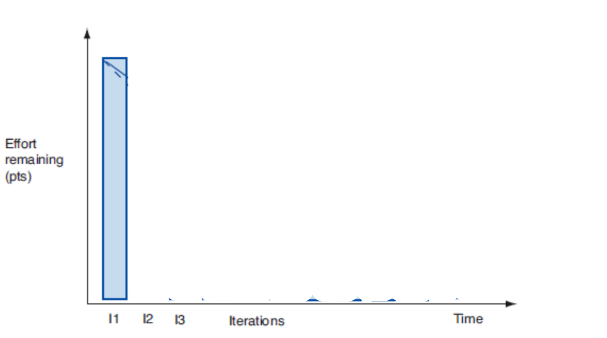{ width=350 }

# Burndown

- Projektin etenemistä kuvataan yleensä release burndown -kaavion avulla

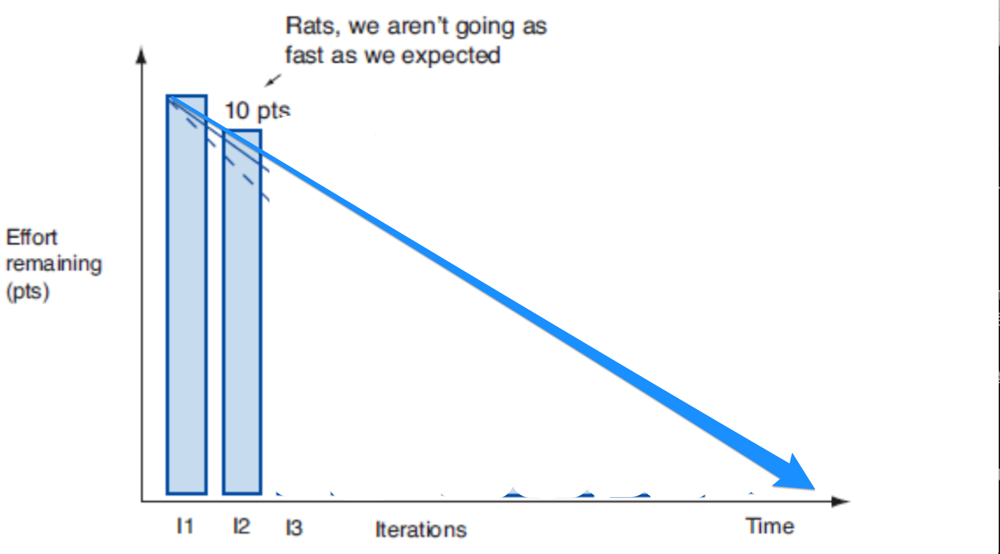{ width=350 }

# Burndown

- Projektin etenemistä kuvataan yleensä release burndown -kaavion avulla

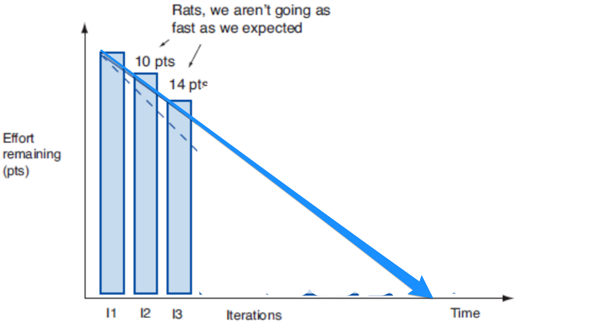{ width=350 }

# Burndown

- Projektin etenemistä kuvataan yleensä release burndown -kaavion avulla

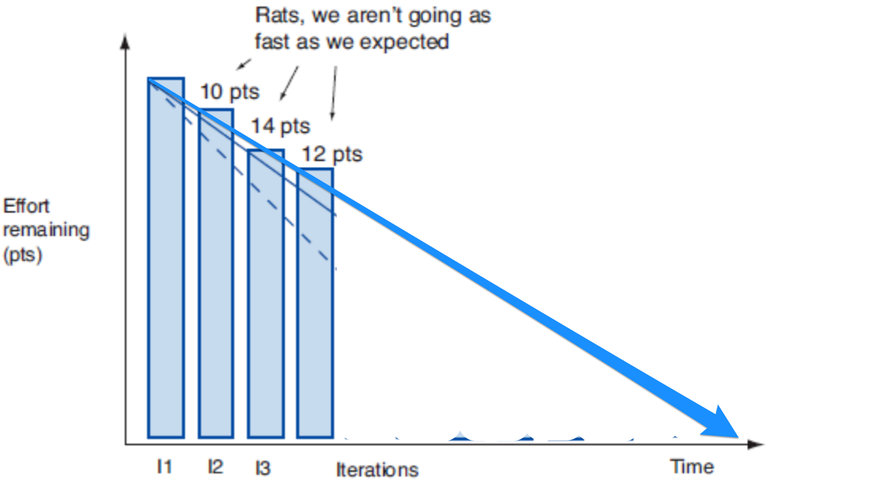{ width=350 }

# Burndown

- Projektin etenemistä kuvataan yleensä release burndown -kaavion avulla

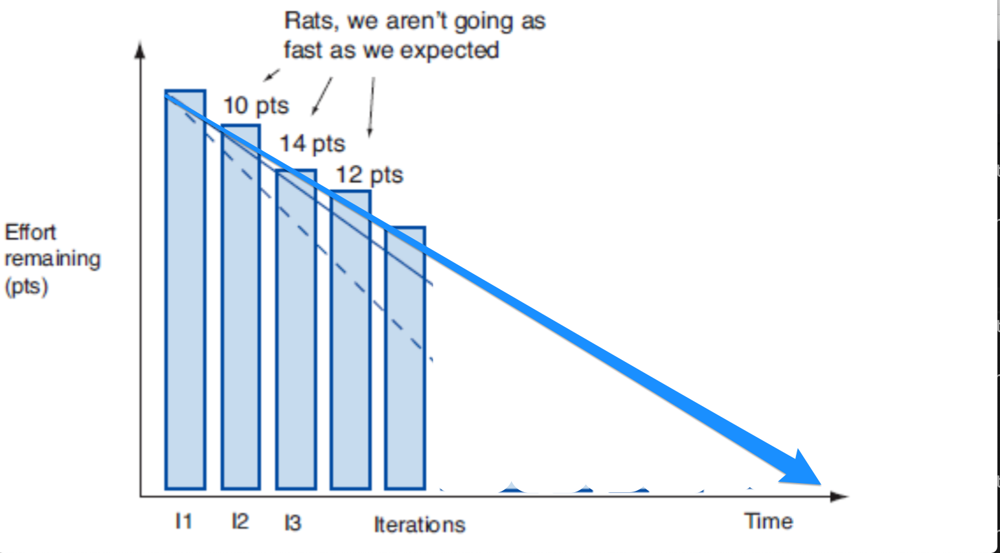{ width=350 }

# Burndown

- Projektin etenemistä kuvataan yleensä release burndown -kaavion avulla

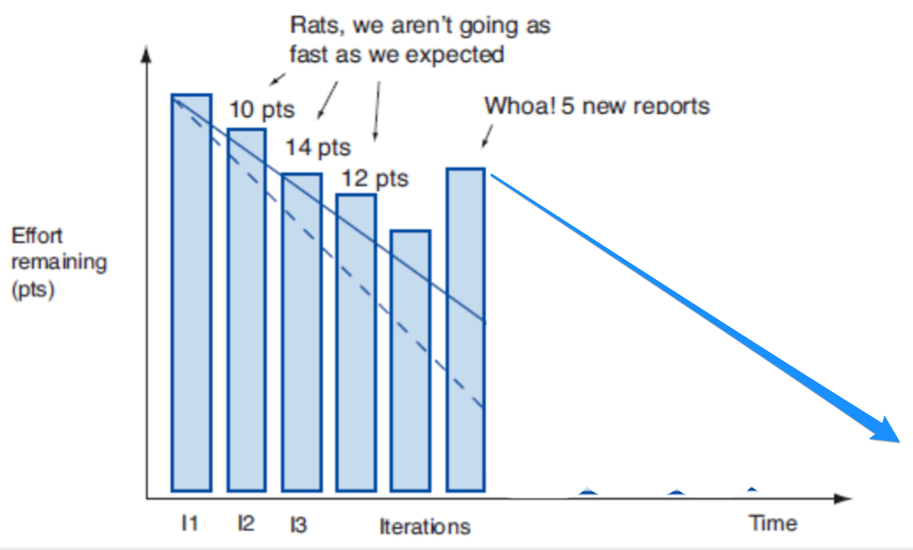{ width=350 }

# Burndown

- Projektin etenemistä kuvataan yleensä release burndown -kaavion avulla

{ width=350 }

# Burnup

- Tuo selkeämmin esiin kesken projektin etenemisen tapahtuvan työmäärän kasvun

{ width=350 }

# Kannattaako estimointi? #NoEstimates

- Storyjen viemän työmäärän arvioimiseen kaksi motivaatiota
  - auttaa asiakasta priorisoinnissa
  - mahdollistaa koko projektin tai kokonaisuuden viemän ajan ja kustannuksen arvioinnin

. . .

- Story point -pohjainen suhteellinen estimointi on saavuttanut vankan aseman
  - Scrum guide mainitsee että backlogin vaatimukset estimoituja
  - Samoin kuten monet parhaat käytänteet kuten DEEP

. . .

- _#NoEstimates_-liike ruvennut kyseenalaistamaan story point -perustaista estimointitapaa
  - pitää siitä saavutettuja hyötyjä liian vähäisinä verrattuna käytettyyn aikaan ja vaivaan

. . .

- Yksinkertainen vaihtoehto: **arvioidaan velositeetti laskemalla kussakin sprintissä valmistuneiden storyjen lukumäärä**

. . .

- Monien kokemuksen mukaan toimii varsin hyvin, jos storyt riittävän tasakokoisia

# Tauko 10 min

# Sprintti

# Sprintin suunnittelu

- Kertauksena viime viikolta: Scrum määrittelee pidettäväksi ennen jokaista sprinttiä _suunnittelupalaverin_

. . .

- Palaverin ensimmäinen tavoite on selvittää _mitä_ sprintin aikana tehdään
  - Lähtökohtana DEEP product backlog

. . .

- Product owner esittelee backlogin kärjessä olevat vaatimukset
  - Tiimin on tarkoitus olla riittävällä tasolla selvillä mitä vaatimuksilla tarkoitetaan

. . .

- Tiimi valitsee niin monta storyä kuin se arvioi kykenevänsä sprintin aikana toteuttamaan definition of donen laadulla

# Sprintin tavoite

- Suunnittelun yhteydessä määritellään _sprintin tavoite_ (goal)
  - Lyhyt, yhden tai kahden lauseen kuvausta siitä, mitä tiimi on aikeissa sprintin aikana tehdä

. . .

- K. Schwaber, ensimmäisen sprintin tavoite: _demonstrate a key piece of user functionality on the selected technology_

. . .

- Verkkokaupan sprinttien tavoitteita voisivat olla:
  - Ostoskorin perustoiminnallisuus: tuotteiden lisäys ja poisto
  - Ostosten maksaminen ja toimitustavan valinta

. . .

- Lyhyt kuvaus parempi niille sidosryhmäläisille, joita ei kiinnosta seurata tapahtumia yksittäisten storyjen tarkkuudella

# Sprintiin valittavat storyt

- Sprintin tavoitteen asettamisen lisäksi tulee valita backlogista sprintin aikana toteutettavat storyt
  - Kehitystiimi päättää kuinka monta storya sprinttiin otetaan

. . .

- Jos velositeetti on selvillä, on valinta periaatteessa helppo

{ width=230 }

- Jos velositettia ei tiedossa, käytetään harkintaa

#

- Product owner voi vaikuttaa sprinttiin mukaan otettaviin storyihin tekemällä uudelleenpriorisointia

{ width=230 }

- Entä jos myös D halutaan sprinttiin?

#

- Uudelleenpriorisoidaan

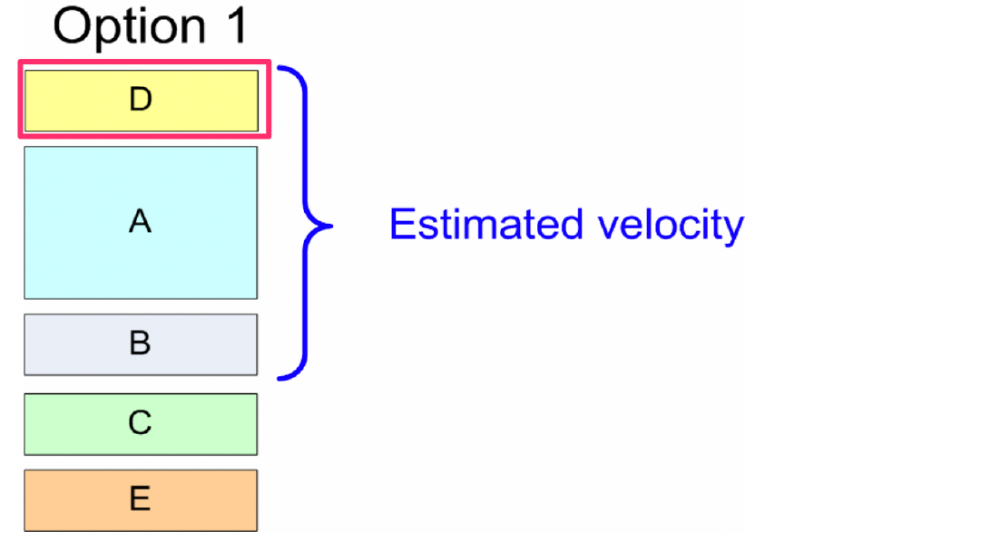{ width=250 }

. . .

- Entä jos myös C halutaan mukaan?

#

- Pienennetään A:n kuvaamaa toiminnallisuutta

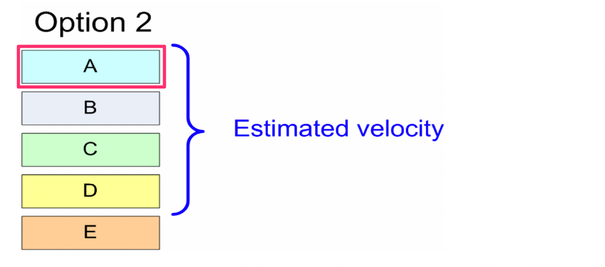{ width=280 }

. . .

- Entä jos A ei saa pienentyä

#

- Jaetaan A kahteen osaan

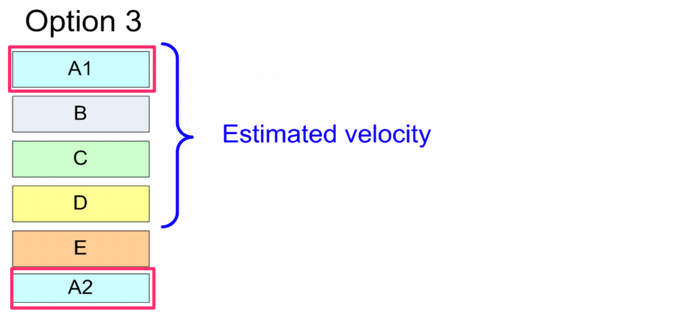{ width=280 }

- Tärkeämpi osa toiminnallisuutta eli A1 mahtuu mukaan sprinttiin, vähemmän tärkeät osat eli A2 jää myöhempiin sprintteihin

# User storyjen jakaminen useampaan osaan

- Haastava aihe, palataan siihen tänään jos aikaa jää
- Luentomateriaalissa jonkin verran ohjeistusta asiaan

- Pääperiaate: jakamisessa syntyvien storyjen edelleen noudatettava INVEST-kriteerejä

# Miten sprintin tavoitteeseen päästään?

- Sprintin suunnittelun yhteydessä sprinttiin valituille user storyille tehdään karkean tason suunnittelu

. . .

- Mietitään mitä _teknisen tason tehtäviä_ (task) on toteutettava, jotta user story saadaan valmiiksi

. . .

- Suunnitellaan komponentteja ja rajapintoja karkealla tasolla

. . .

- Huomioidaan uusien storyn aiheuttamat muutokset olemassa olevaan osaan sovelluksesta

# Storyn jako taskeihin, esimerkki

- Esimerkiksi _tuotteen lisääminen ostoskoriin_, voitaisiin jakaa seuraaviin teknisiin taskeihin:
  - tarvitaan sessio, joka muistaa asiakkaan
  - oliot ja tietorakenteet ostoskorin ja ostoksen esittämiseen
  - laajennus tietokantaskeemaan
  - html-näkymää päivitettävä tarvittavilla painikkeilla
  - kontrolleri painikkeiden käsittelyyn
  - yksikkötestit kontrollerille ja ostoskorin logiikalle
  - hyväksymätestien automatisointi

. . .

- Kaikkia storyyn liittyviä taskeja ei sprintin suunnittelun aikana löydetä
  - Uusia taskeja generoidaan tarvittaessa sprintin edetessä

# Sprint backlog

- _Sprint backlog_ koostuu sprintiin valituista storyista ja niihin liittyvistä tehtävistä eli taskeista

. . .

- Sprint backlog usein organisoitu taskboardiksi

{ width=250 }

- Taskit niiden valmistumisastetta kuvaavassa sarakkeessa

# Sprint backlogin työmääräarviot

- Sprintissä arvioidaan päivittäin kunkin taskin _jäljellä olevaksi arvioitua työmäärää_
  - Usein tapana tehdä arviot tunteina

. . .

{ width=350 }

# Sprintin burndown etenemisen seurantaan

{ width=450 }

# Kannattaako taskeille tehdä työmääräarviot?

- _A Scrum book 2019_ ei suosittele taskien tasolla tehtävää työmääräarviointia
  - Kehottaa seuraamaan sprinttien aikana ainoastaan sitä kuinka monen story pointin verran storyja saatu valmiiksi

. . .

- On mahdollista, että tiimi saa sprintissä valmiiksi lähes kaikki taskit, saamatta valmiiksi yhtäkään storya
  - Burn down voi näyttää pitkään melko hyvältä, mutta asiakkaan saama arvo on lopulta nolla

. . .

- Yksinkertainen tapa sprintin etenemisen seurantaan
  - laske, tai katsoa taskboardilta, mikä on jo valmiiden ja vielä valmistumattomien sprinttiin kuuluvien taskien lukumäärä

# Joskus Sprinteissä ...

{ width=350 }

# Joskus Sprinteissä käy näin

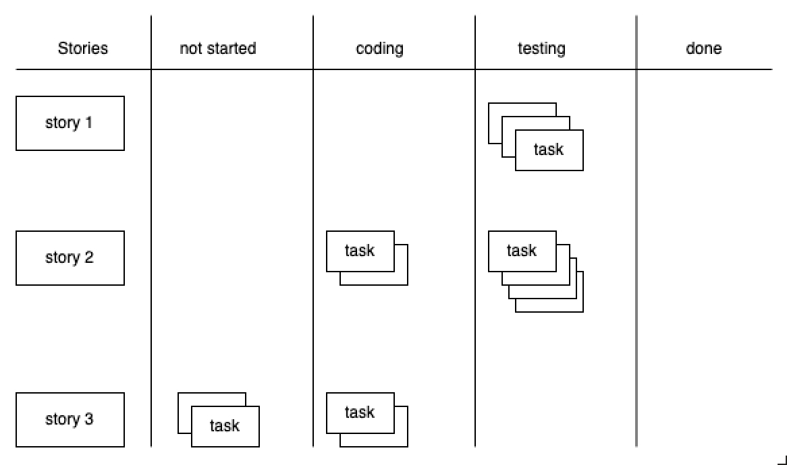{ width=350 }

# Puolivalmis työ kasautuu ja asiat eivät valmistu

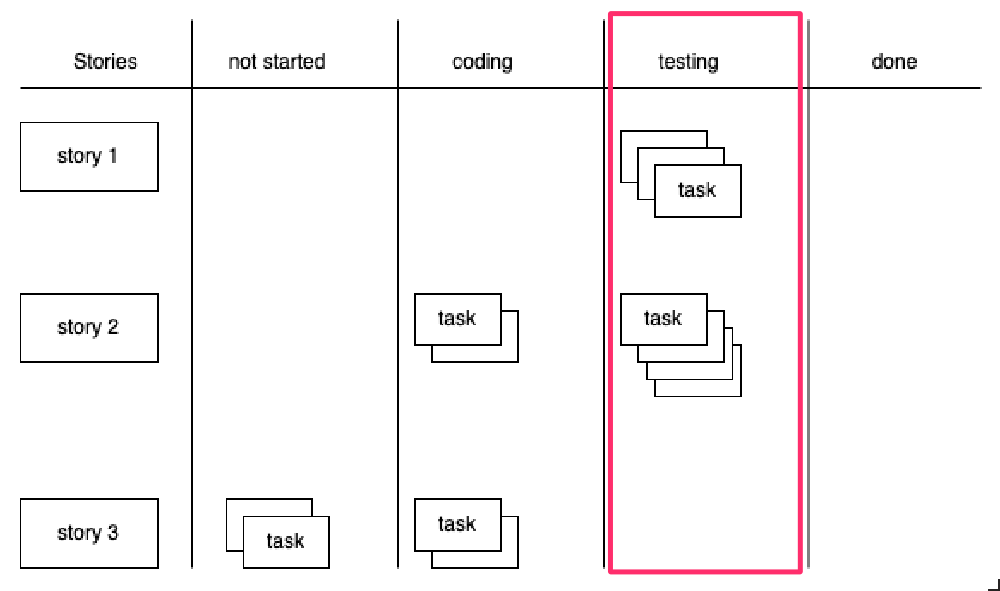{ width=350 }

# WIP-rajoitteet

- Yhtä aikaa työn alla olevien taskien suuri määrä voi koitua ongelmaksi
  - Riski sille, että sprintin päätyttyä paljon osittain valmiita storyja kasvaa

. . .

- Ratkaisu: _work in progress eli WIP_ -rajoitteet

{ width=300 }

# Kanban ja Lean

- WIP-rajoitusten idea on peräisin _Kanban_-menetelmästä, joka on eräs keskeisimmistä _Lean_-ajattelun työkaluista
  - Lean-ajattelu on peräisin jo kymmeniä vuosia vanhasta Toyota Production Systemistä

. . .

- Lean-ajattelun taustalla on idea _hukan_ eli asiakkaalle arvoa tuottamattomien asioiden eliminoimisessa

. . .

- Toiminnallisuudet tuovat arvoa vasta käytössä, sitä ennen ne sitovat turhaan kustannuksia ja tuovat riskejä

. . .

- Hukkaa muun muassa: osittain tehty työ, välivarastointi ja turha odottaminen
  - Työn alla olevat storyt jotka eivät ole vielä DoD-tasolla valmiina
  - testaamista odottava toiminnallisuus
  - testatut mutta tuotantoon viemistä vielä odottavat toiminnallisuudet

# WIP-rajoitteiden soveltaminen

- WIP-rajoitteita voidaan soveltaa Scrumin yhteydessä monella tavalla

. . .

- Järkevintä on rajoittaa sprintin aikana yhtäaikaa työn alla olevien storyjen määrää mahdollisimman pieneksi

. . .

- On myös tavallista rajoittaa eri työvaiheessa, esim. toteutuksen olevien taskien määrää

. . .

- tai yksittäisellä sovelluskehittäjän kerrallaan työn alla olevien töiden määrää

. . .

- WIP-rajoitteita säädetään usein retrospektiivien yhteydessä jos kehitystyössä havaitaan ongelmia

#

# Storyjen jakaminen

- Haastava aihe aloittelijalle ja joskus myös kokeneille ohjelmistokehittäjille

- Pääperiaate: jakamisessa syntyvien storyjen edelleen noudatettava INVEST-kriteerejä

- Richard Lawrencen ohjeita

# Pattern 1: business rule variations

_As a user, I can search for flights with flexible dates._

. . .

kannattaa jakaa siten että jokainen näistä ehdoista eritellään omaksi storykseen

- _... as "between dates x and y"_
- _... as "a weekend in December"_
- _... as "± n days of dates x and y"_

# Pattern 2: simple/complex

_As a user, I can search for flights between two destinations_

. . .

voidaan jakaa seuraavasti

- _... when only direct flights used_
- _... specifying a max number of stops_
- _... including nearby airports_
- _... using flexible dates_

# Pattern 3: major effort

_As a user, I can pay for my flight with VISA, MasterCard, Diners Club, or American Expres._

. . .

voitaisiin jakaa kahtia, missä ensimmäisessä storyssa vasta hoidettaisiin yksi luottokorttityyppi, ja seuraava story yleistäisi toiminnan kaikkiin kortteihin:

- _... I can pay with VISA_
- _... I can pay with all four credit card types (VISA, MC, DC, AMEX) (given one card type already implemented)_

# Pattern 4: data entry methods

_As a user, I can search for flights between two destinations_

. . .

jakaantuukin helposti kahteen esim. seuraavasti

- _... using simple date input_
- _... with a fancy calendar UI_

# Pattern 5: Defer Performance

_As a user, I can search for flights between two destinations_

. . .

jakaantuu kahtia seuraavasti:

- _... slow—just get it done, show a "searching" animation_
- _... in under 5 seconds_

# Pattern 6: Operations

_As a user, I can manage my account_

. . .

jakaantuu moneen osaan

- _... I can sign up for an account_
- _... I can edit my account settings_
- _... I can cancel my account_

# Pattern 7: Break Out a Spike

Jos tiimi ei ole toteuttanut koskaan luottokorttimaksuun liittyvää toiminnallisuutta, user storysta

_As a user, I can pay by credit card_

kannattaa eriyttää aikarajattu eksperimentti joka suoritetaan aiemmassa sprintissä.

Tämän jälkeen toivon mukaan varsinaisen toiminnallisuuden toteuttava story osataan estimoida paremmin:

- _Investigate credit card processing_
- _Implement credit card processing_

#

# Pattern 8: workflow steps

Tarkastellaan sovellusta jonka avulla voi julkaista artikkeleja yrityksen web-sivulle. Eräs sovelluksen user storyista on seuraava:

_As a content manager, I can publish a news story to the corporate website._

. . .

Eräs tapa pilkkoa alkuperäinen story onkin jakaa se useampaan osaan eri työvaiheiden mukaan:

- _... I can publish a news story directly to the corporate website_
- _... I can publish a news story with editor review on a staging site_
- _... I can publish a news story with legal review on a staging site_
- _... I can view a news story on a staging site_
- _... I can publish a news story from the staging site to production_
