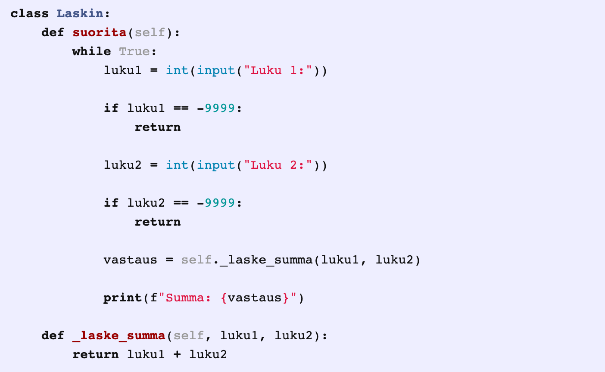
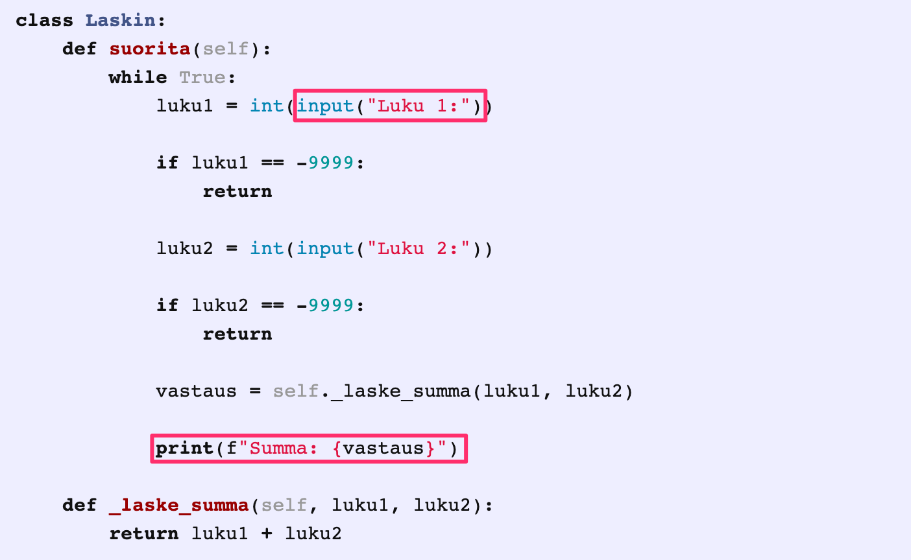
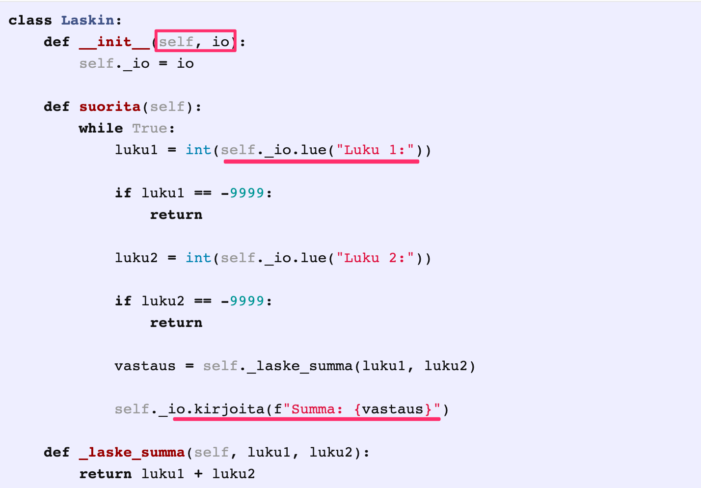
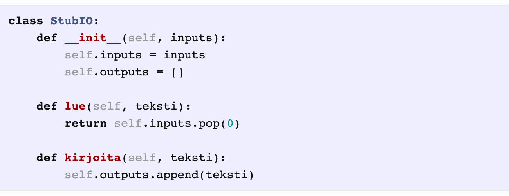
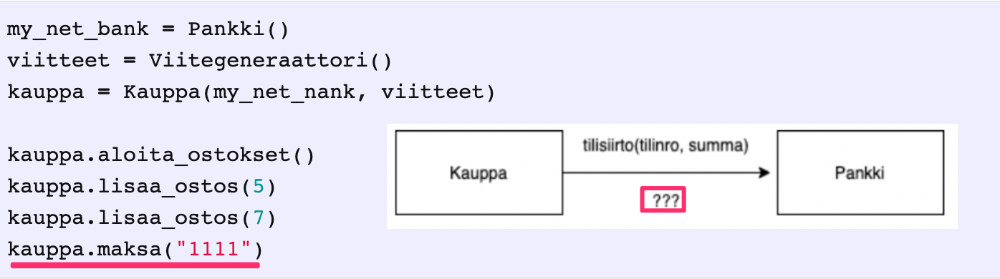
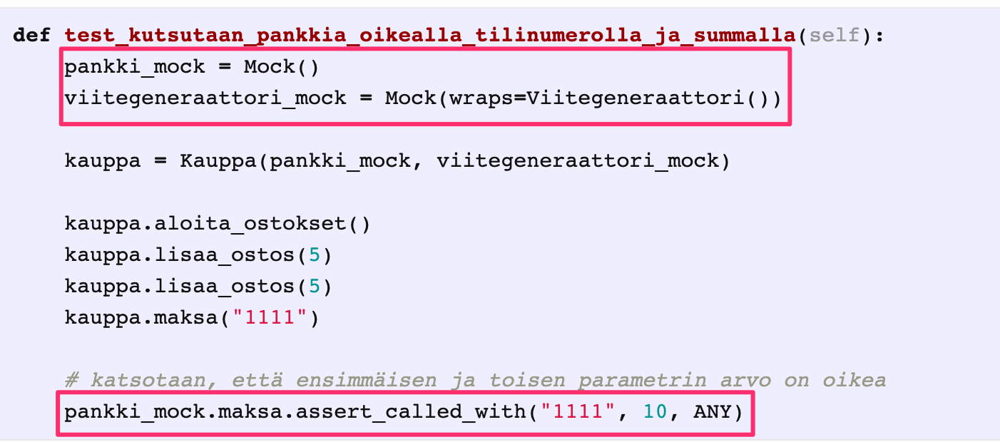
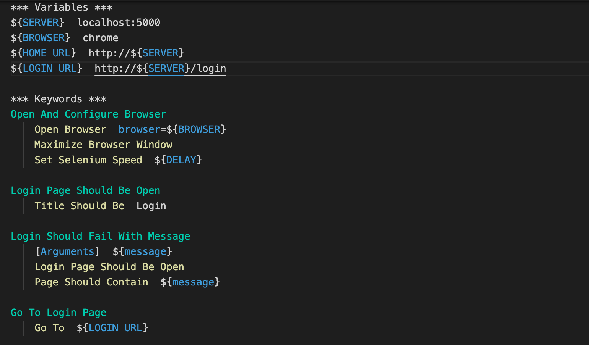
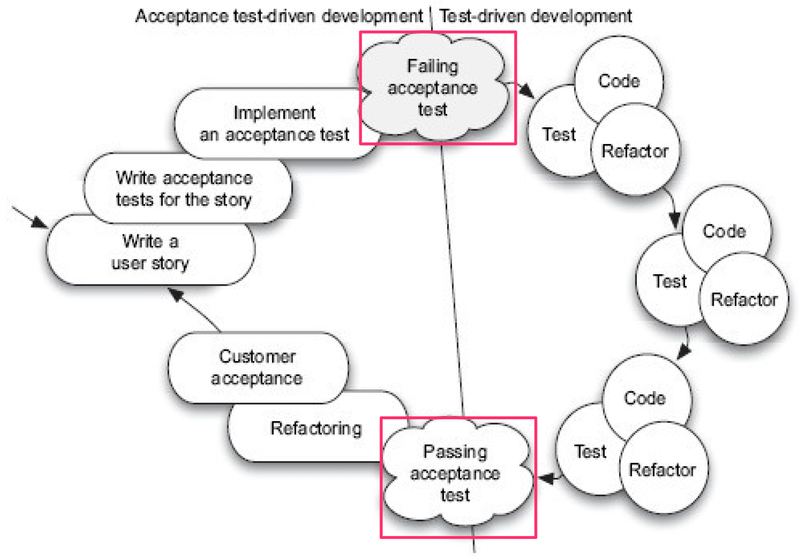

% Ohjelmistotuotanto
% Matti Luukkainen ja ohjaajat Valtteri Kantanen, Hannah Leinson, Riku Rauhala, Ville Saastamoinen
% syksy 2023

#

&nbsp;&nbsp;&nbsp;&nbsp;&nbsp;&nbsp;&nbsp;&nbsp;&nbsp;&nbsp;&nbsp;&nbsp;&nbsp;&nbsp;&nbsp;&nbsp;&nbsp;&nbsp;&nbsp;&nbsp;&nbsp;&nbsp;&nbsp;&nbsp;&nbsp;&nbsp;&nbsp;&nbsp;&nbsp;&nbsp;&nbsp;&nbsp;&nbsp;&nbsp;&nbsp;&nbsp;&nbsp;Luento 6

&nbsp;&nbsp;&nbsp;&nbsp;&nbsp;&nbsp;&nbsp;&nbsp;&nbsp;&nbsp;&nbsp;&nbsp;&nbsp;&nbsp;&nbsp;&nbsp;&nbsp;&nbsp;&nbsp;&nbsp;&nbsp;&nbsp;&nbsp;&nbsp;&nbsp;&nbsp;&nbsp;&nbsp;&nbsp;&nbsp;&nbsp;&nbsp;&nbsp;&nbsp;&nbsp;&nbsp;14.11.2022

# Kurssipalaute

- Kurssipalaute
  - Kurssilla lopussa kerättävän palautteen lisäksi ns. jatkuva palaute https://coursefeedback.helsinki.fi
  - "jatkuvan palautteen" toiminnallisuus on vasta koekäytössä, ja sitä kehitetään mm. tämän kurssin kokemusten myötä

# Ketterien menetelmien testauskäytänteet

- Testauksen rooli ketterissä menetelmissä poikkeaa huomattavasti vesiputousmallista
  - Sprintin aikana toteutettavat ominaisuudet integroidaan muuhun koodiin sekä testataan

. . .

- Sykli ominaisuuden määrittelystä siihen että se on valmis ja testattu on erittäin lyhyt

. . .

- Testausta tehdään sprintin "ensimmäisestä päivästä" lähtien, testaus integroitu suunnitteluun ja toteutukseen

. . .

- Automatisointi erittäin tärkeässä roolissa
  - testejä suoritetaan usein

# Testaajat osana kehitystiimiä

- Ideaalitilanteessa testaajia sijoitettu kehittäjätiimiin, myös ohjelmoijat kirjoittavat testejä
  - tiimit _cross functional_

. . .

- Testaajan rooli: _virheiden etsijästä virheiden estäjään_
  - testaaja auttaa tiimiä kirjoittamaan automatisoituja testejä, jotka pyrkivät estämään bugien pääsyn koodiin
  - _build quality in_

# Ketterien menetelmien testauskäytänteitä

. . .

- Test driven development (TDD)
  - Nimestä huolimatta kyseessä toteutus- ja suunnittelutekniikka
  - Sivutuotteena paljon automaattisesti suoritettavia testejä

. . .

- Acceptance Test Driven Development / Behavior Driven Development
  - User storyjen tasolla tapahtuva automatisoitu testaus

. . .

- Continuous Integration (CI) eli jatkuva integraatio
  - Perinteisen integraatio- ja integraatiotestausvaiheen korvaava työskentelytapa

. . .

- Exploratory testing, suomeksi tutkiva testaus
  - Järjestelmätestauksen tekniikka, jossa testaaminen tapahtuu ilman formaalia testaussuunnitelmaa

. . .

- Tuotannossa tapahtuva testaus
  - Nouseva trendi suorittaa uusien ominaisuuksien laadunhallintaa siinä vaiheessa kun osa käyttäjistä ottanut ne käyttöönsä

# Test driven development (TDD)

{ width=340 }

. . .

1. Kirjoitetaan sen verran testiä että testi ei mene läpi

. . .

2. Kirjoitetaan koodia sen verran, että testi menee läpi

. . .

3. Jos huomataan koodin rakenteen menneen huonoksi refaktoroidaan koodin rakenne paremmaksi

. . .

4. Jatketaan askeleesta 1

# Test driven development (TDD)

- Yksi XP:n käytänteistä, Kent Beckin kehittämä
  - Joskus käytössä _tests first development_

. . .

- TDD:llä ohjelmoitaessa toteutettavaa komponenttia ei yleensä ole tapana suunnitella tyhjentävästi etukäteen

. . .

- Testit kirjoitetaan ensisijaisesti ajatellen komponentin käyttöä
  - huomio komponentin rajapinnassa ja sen helppokäyttöisyydessä
  - ei niinkään komponentin sisäisessä toteutuksessa

. . .

- Komponentin sisäinen rakenne muotoutuu refaktorointien kautta

. . .

- _"Ensin testataan, sitten koodataan, suunnitellaan vasta lopussa"_

#

- TDD:ssä korostetaan lopputuloksen yksinkertaisuutta

. . .

- Toteutetaan toiminnallisuutta vain sen verran, mitä testien läpimeno edellyttää
  - Ei toteuteta ”varalta” ekstratoiminnallisuutta, sillä "You ain't gonna need it" (YAGNI)
  - _Simplicity – the art of maximizing the amount of work not done – is essential_

. . .

- Koodista on vaikea tehdä testattavaa jos se ei ole modulaarista ja löyhästi kytketyistä komponenteista koostuvaa
  - TDD:llä koodattu laadukasta ylläpidettävyyden ja laajennettavuuden kannalta

. . .

- Muita TDD:n hyviä puolia:
  - Rohkaisee ottamaan pieniä askelia kerrallaan ja toimimaan fokusoidusti
  - Virheet havaitaan nopeasti suuren testijoukon takia
  - Hyvin kirjoitetut testit toimivat toteutetun komponentin rajapinnan dokumentaationa

# TDD:llä on myös ikävät puolensa

- Testikoodia tulee paljon, usein suunnilleen saman verran kuin varsinaista koodia
  - Toisaalta TDD:llä tehty tuotantokoodi on usein hieman normaalisti tehtyä koodia lyhempi

. . .

- Jos ja kun koodi muuttuu, tulee testejä ylläpitää

. . .

- TDD:n käyttö on haastavaa mm. käyttöliittymä-, tietokanta- ja verkkoyhteyksistä huolehtivan koodin yhteydessä

. . .

- Legacy-koodin laajentaminen TDD:llä voi olla haastavaa

. . .

- Tutkimusnäyttö TDD:n hyödyistä vähäistä

# 16.1.2023-

. . .

Open Uni: Test-Driven Development 4 + 1 cr

- Esko Luontola Nitor (Suomen johtava TDD-asiantuntija)

{ width=350 }

# Riippuvuudet testeissä

. . .

{ width=400 }

# Riippuvuudet testeissä

{ width=400 }

# Riippuvuudet testeissä: dependency injection

{ width=400 }

# Riippuvuudet testeissä: valeriippuvuudet

- Dependency Injection -suunnittelumalli mahdollistaa stubien eli "vale"-riippuvuuksien asettamisen luokille testistä käsin

. . .

- Stubeihin voidaan kovakoodata metodikutsujen tulokset valmiiksi
- Testi voi kysellä stubilta millä arvoilla sitä kutsuttiin
  - tällaisia stubeja kutsutaan _mock_-olioiksi

. . .

{ width=400 }

# Itse toteutettu stub/mock

{ width=400 }

# Mock-kirjastot

- Olemassa useita kirjastoja mock-olioiden luomisen helpottamiseksi
  - laskareissa _unittest-mock_ (Python) _Mockito_ (Java)

. . .

- Kaupan metodin _maksa_ pitää tehdä _tilisiirto_ kutsumalla _Pankin_ metodia

{ width=400 }

#

{ width=400 }

# Storyjen testaaminen

. . .

- User storyn käsite pitää sisällään _hyväksymiskriteerit_
  - _tests that convey and document details and that will be used to determine that the story is complete_

. . .

- Storyn _asiakas voi lisätä tuotteen ostoskoriin_ eräs hyväksymiskriteeri voisi olla
  - ollessaan tuotelistauksessa ja valitessaan tuotteen jota on varastossa, menee tuote ostoskoriin ja ostoskorin hinta sekä korissa olevien tuotteiden määrä päivittyy oikein

. . .

- Hyväksymiskriteereistä saadaan muodostettua suurin osa ohjelmiston järjestelmätason toiminnallisista testeistä

. . .

- Hyväksymiskriteerit on tarkoituksenmukaista kirjoittaa heti storyn toteuttavan sprintin alussa
  - yhteistyössä kehitystiimin ja product ownerin kesken
  - asiakkaan kielellä, käyttämättä teknistä jargonia

# Järjestelmätestauksen automatisointi, ATDD ja BDD

- Ideaalitilanteessa storyjen hyväksymiskriteereistä tehdään automaattisesti suoritettavia

. . .

- Olemassa monia työkaluja
  - eräs suosituimmista on suomalainen python-pohjainen _Robot framework_ jota kurssin Python-versio käyttää
  - Kurssin Java-versiossa käytössä _Cucumber_

. . .

- Käytetään nimitystä _Acceptance test driven development_ (ATDD) tai _Behavior driven development_ (BDD)
  - erityisesti jos testit toteutetaan jo iteraation alkupuolella, ennen kun story koodattu

# Käyttäjähallinnan tarjoama palvelu

- Palvelun vaatimukset määrittelevät user storyt
  - A new user account can be created if a proper unused username and a proper password are given
  - User can log in with a valid username/password-combination

. . .

- Robot-frameworkia käytettäessä jokaisesta storystä kirjoitetaan .robot- päätteinen tiedosto
  - sisältää joukon storyyn liittyvä hyväksymistestejä

. . .

- Storyn hyväksymätestit kirjoitetaan hyödyntäen _avainsanoja_

# Testit asiakkan kielellä

{ width=400 }

- _Input Credentials_, _Output should contain_ ym avainsanoja

# Avainsanat mäpätään kooditasolle

- Avainsanojen määrittely toisten avainsanojen avulla

{ width=340 }

. . .

- tai koodina

{ width=340 }

# Käyttöliittymän läpi tapahtuvan testauksen automatisointi

- Komentoriviä käyttävien sovellusten testaaminen onnistuu helpohkosti, mockaamalla syöte- ja tulostusvirrat

. . .

- Myös Web-sovellusten testauksen automatisointi onnistuu
  - eräs ratkaisu _Selenium_, joka mahollistaa selaimen käytön ohjelmointirajapintaa käyttäen
  - _headless-selaimet_ toinen vaihtoehto

# Web-sovellusten testaaminen onnistuu Selenium:illa

{ width=400 }

- Robot sisältää runsaasti valmiiksi määriteltyjä avainsanoja

# Motivaatio käyttäjän kielellä kirjoitetuille testeille

. . .

- Product owner kirjoittaa tiimin kanssa yhteistyössä storyyn liittyvät testit
  - Samalla storyn haluttu toiminnallisuus tulee dokumentoitua sillä tarkkuudella, että ohjelmoijat ymmärtävät mistä on kyse

. . .

- Koodaajat/testaajat toteuttavat avainsanat siten, että testien automaattinen suoritus onnistuu

. . .

- Ei toistaiseksi vielä kovin yleinen tyyli, useimmiten hyväksymätestit kirjoitettu suoraan "normalilla" testikirjastolla
  - JUnit, Mocha, Jest, Rspec ...

# Acceptane Test Driven Development ja TDD

{ width=400 }

# Tauko 10 min

# Ohjelmiston integraatio

. . .

- Vesiputousmallissa toteutusvaiheen päättää integrointi
  - Yksittäin testatut komponentit integroidaan yhdessä toimivaksi kokonaisuudeksi
  - Yhteistoiminnallisuus varmistetaan integraatiotestein

. . .

- Perinteisesti integrointi on tuonut esiin paljon ongelmia
  - Tarkasta suunnittelusta huolimatta erillisten tiimien toteuttamat komponentit epäyhteensopivia

. . .

- Suurten projektien integrointivaihe on kestänyt ennakoimattoman kauan

. . .

- Integrointivaiheen ongelmat ovat aiheuttaneet ohjelmaan suunnittelutason muutoksia

. . .

- _Integratiohelvetti_

# Pois integraatiohelvetistä

- 90-luvulla huomattiin, että riskien minimoimiseksi integraatio kannattaa tehdä useammin kuin vain projektin lopussa

. . .

- Muodostui uusi paras käytänne: _daily build_ ja _smoke test_
  - The _smoke test_ should exercise the entire system from end to end.
  - It does not have to be exhaustive,
  - but it should be capable of exposing major problems

. . .

- Daily buildia ja smoke testiä käytettäessä järjestelmän integraatio tehdään (ainakin jollain tarkkuustasolla) joka päivä

. . .

- Komponenttien yhteensopivuusongelmat huomataan nopeasti ja niiden korjaaminen helpottuu

. . .

- Tiimin moraali paranee, kun ohjelmistosta on olemassa päivittäin kasvava toimiva versio

# Päivittäisestä jatkuvaan integraatioon

- Syntyi idea toistaa integraatiota vielä päivittäistä sykliäkin useammin: _jatkuva integraatio eli continuous integration_
  - eräs XP:n käytenäteistä

. . .

- Koodi, automatisoidut testi, konfiguraatiot ja build-skriptit pidetään keskitetyssä repositoriossa

. . .

- _CI-palvelin_: vastaa konfiguraatioilta mahdollisimman läheisesti tuotantopalvelinta

. . .

- CI-palvelin tarkkailee repositoriota, muutosten tapahtuessa se hakee koodin, kääntää sen ja suorittaa testit

. . .

- Jos koodi ei käänny tai testit eivät mene läpi, seurauksena poikkeustilanne joka korjattava _välittömästi_

. . .

- Integraatiosta vaivaton operaatio: ohjelmistosta olemassa koko ajan integroitu ja testattu tuore versio

#

{ width=400 }

#

- Sovelluskehittäjä aloittaa työskentelyn hakemalla koodin uusimman version versionhallinnasta

. . .

- Kehittäjä integroi koodinsa heti muuhun koodiin ja tekee riittävän määrän automatisoituja testejä

. . .

- Suorittaa testit paikallisesti, ja jos ne menevät läpi, pushaa koodin CI-palvelimelle
  - Näin minimoituu mahdollisuus, että lisätty koodi toimii ainoastaan kehittäjän koneella

. . .

- Tarkoitus että jokainen kehittäjä integroi koodinsa muuhun koodiin mahdollisimman usein, vähintään kerran päivässä

. . .

- CI rohkaisee jakamaan työn pieniin osiin, sellaisiin jotka saadaan testeineen valmiiksi yhden työpäivän aikana
  - CI-työprosessin noudattaminen vaatii kurinalaisuutta

#

- Jotta CI-prosessi toimisi jouhevasti, tulee testien suorittamisen tapahtua nopeasti, yli 10 min alkaa olla liikaa

. . .

- Jos osa testeistä on hitaita, voidaan testit konfiguroida ajettavaksi kahdessa (tai useammassa) vaiheessa
  - _commit build_:in läpimeno antaa kehittäjälle oikeuden pushata koodi repositorioon
  - CI-palvelimella suoritetaan myös hitaammat testit sisältävä _secondary build_

. . .

- Laskareissa käytetty _GitHub Actions_ on yksi monista SaaS-palveluna toimivista CI-ratkaisuista, monien mielestä tämän hetken paras
  - CircleCI ja Travis muita yleisesti käytettyjä

. . .

- Näitä paljon vanhempi Jenkins lienee edelleen maailmalla eniten käytetty CI-palvelinohjelmisto
  - Jenkinsin käyttö edellyttää sen asentamista omalle palvelimelle

# Deployment pipeline

- Viimeaikaisen trendin mukaan CI:tä viedään vielä askel pidemmälle

. . .

- Integraatioprosessiin lisätään automaattinen _deployaus_ staging-palvelimelle
  - Ympäristö, joka kaikin tavoin mahdollisimman lähellä tuotantoympäristöä

. . .

- Kun uusi versio deployattu staging-palvelimelle, suoritetaan sille hyväksymistestaus

. . .

- ...jonka jälkeen uusi versio voidaan siirtää _tuotantopalvelimelle_

. . .

- Parhaassa tapauksessa staging-ympäristössä tehtävien hyväksymätestien suoritus on automatisoitu
  - Ohjelmisto kulkee koko _deployment pipelinen_ läpi automaattisesti

# Deployment pipeline

- Vaiheet, joiden suorittaminen edellytetään, että commitattu koodi saadaan siirrettyä staging/tuotantoympäristöön

{ width=400 }

# Jatkuva toimittaminen ja toimitusvalmius

- Jos jokainen testit läpäisevä commit päätyy automaattisesti tuotantoon, puhutaan _jatkuvasta toimittamisesta_ engl. _continuous deployment_

. . .

- Jos deployment-päätös tehdään ihmisen toimesta, sovelletaan _jatkuvaa toimitusvalmiuutta_ engl. _continuous delivery_
  - On olemassa hyviä syitä miksi ihan kaikkea ei haluta heti julkaista loppukäyttäjille asti

. . .

- Viime aikojen trendi julkaista web-palvelusta jopa kymmeniä uusia versiota päivästä
  - Amazon, Netflix, Facebook, Smartly...

# Tutkiva testaaminen

- Jotta järjestelmä saadaan riittävän virheettömäksi, on testaus suoritettava erittäin perusteellisesti

. . .

- Perinteinen tapa järjestelmätestauksen on ollut laatia ennen testausta hyvin perinpohjainen suunnitelma
  - Jokaisesta testistä on kirjattu testisyötteet ja odotettu tulos

. . .

- Tuloksen tarkastaminen
  - Verrataan ohjelmiston toimintaa testitapaukseen kirjattuun odotettuun tulokseen

#

{ width=400 }

#

{ width=400 }

#

{ width=400 }

#

- Automatisoitujen hyväksymistestien luonne sama, syöte on tarkkaan kiinnitetty samoin kuin odotettu tuloskin

. . .

- Jos testataan vain etukäteen mietittyjen testien avulla, ei kaikkia yllättäviä tilanteita osata ennakoida

. . .

- Hyvät testaajat ovat aina tehneet "virallisen" dokumentoidun testauksen lisäksi epävirallista "ad hoc"-testausta

. . .

- Tästä tullut virallisesti hyväksytty testauksen muoto, kulkee nimellä _tutkiva testaaminen_ (engl. exploratory testing)

# Tutkiva testaaminen

- _Exploratory testing is simultaneous learning, test design and test execution_

. . .

- Testitapauksia ei suunnitella kattavasti etukäteen
  - Testaaja pyrkii kokemuksensa avulla löytämään järjestelmästä virheitä
  - Testaaja ohjaa toimintaansa suorittamiensa testien tuloksen perusteella

. . .

- Tutkiva testaaminen ei kuitenkaan etene täysin sattumanvaraisesti
  - Testaussessiolle asetetaan tavoite: mitä tutkitaan ja minkälaisia virheitä etsitään

. . .

- Ketterässä ohjelmistotuotannossa tavoite voi jäsentyä muutaman user storyn toiminnallisuuden ympärille
  - _testataan ostosten lisäystä ja poistoa ostoskorista_

# Tutkiva testaaminen

- Keskeistä on kaikkien ohjelmiston tapahtuvien asioiden havainnointi
  - Etukäteen määritellyissä testeissä havainnoidaan ainoastaan reagoiko järjestelmä odotetulla tavalla

. . .

- Kiinnitetään huomio myös varsinaisen testauksen kohteen ulkopuoleisiin asioihin
  - Klikkaillaan käyttöliittymän nappuloita epäloogisissa tilanteissa
  - Jos huomataan selaimen osoiterivillä URL https://www.webshopshop.com/ostoskori?id=10 katsotaan mitä tapahtuu jo id muutetaan käsin
  - ...

. . .

- Tietoturvan testaamisessa on monia tyypillisiä skenaariota, joita testataan tutkivan testaamisen menetelmin
  - Esim. SQL- ja JavaScript-injektiot

# Tutkiva testaaminen

- Löydettyjen virheiden toistuminen jatkossa kannattaa eliminoida tekemällä automatisoituja regressiotestejä

. . .

- Tutkivaa testaamista ei kannata käyttää regressiotestaamisen menetelmänä
  - Testataan sprintin yhteydessä toteutettuja uusia ominaisuuksia

. . .

- Ei vaihtoehto normaaleille tarkkaan etukäteen määritellyille testeille vaan niitä täydentävä testauksen muoto
