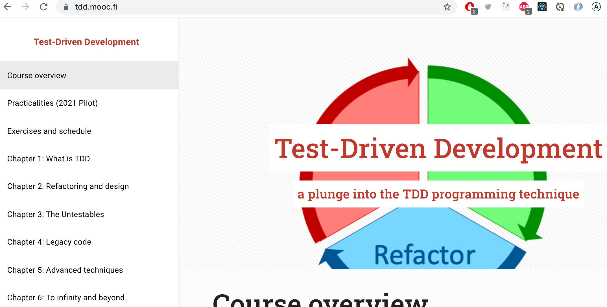
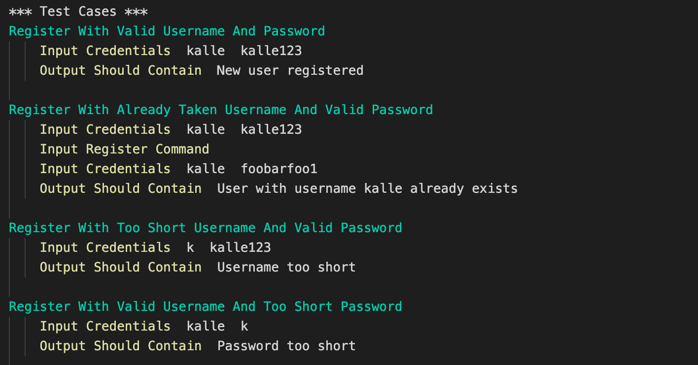
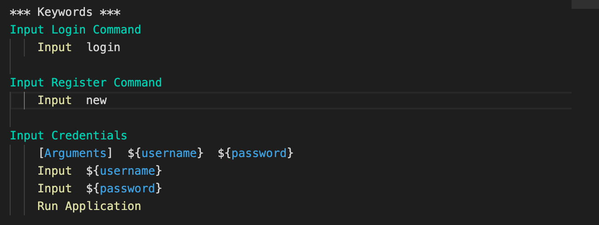
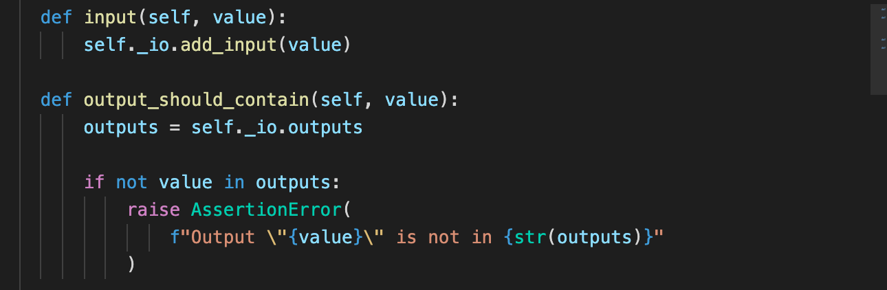
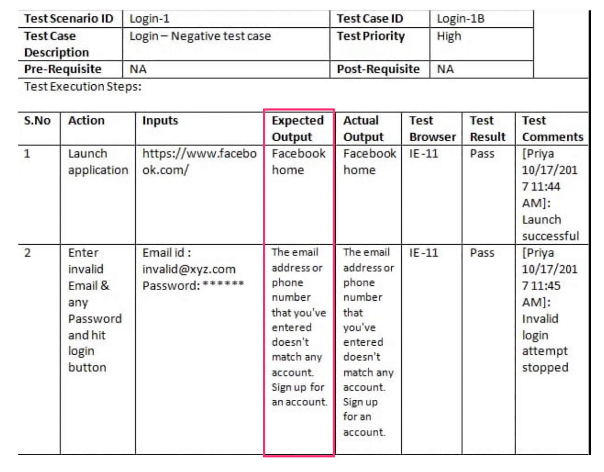
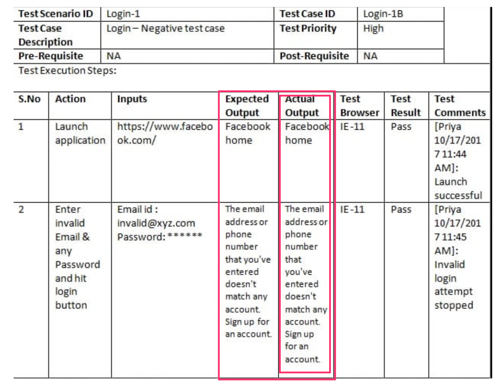
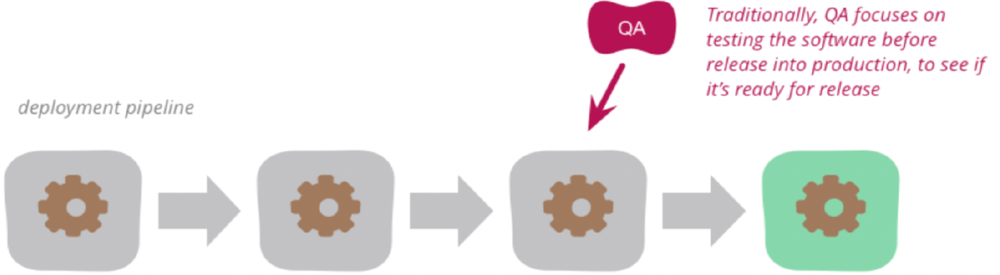
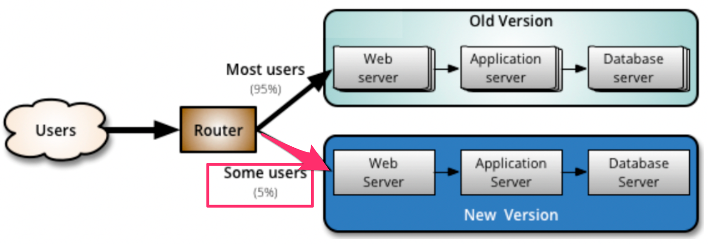

% Ohjelmistotuotanto
% Matti Luukkainen ja ohjaajat Valtteri Kantanen, Hannah Leinson, Riku Rauhala, Ville Saastamoinen
% syksy 2023

#

&nbsp;&nbsp;&nbsp;&nbsp;&nbsp;&nbsp;&nbsp;&nbsp;&nbsp;&nbsp;&nbsp;&nbsp;&nbsp;&nbsp;&nbsp;&nbsp;&nbsp;&nbsp;&nbsp;&nbsp;&nbsp;&nbsp;&nbsp;&nbsp;&nbsp;&nbsp;&nbsp;&nbsp;&nbsp;&nbsp;&nbsp;&nbsp;&nbsp;&nbsp;&nbsp;&nbsp;&nbsp;Luento 6

&nbsp;&nbsp;&nbsp;&nbsp;&nbsp;&nbsp;&nbsp;&nbsp;&nbsp;&nbsp;&nbsp;&nbsp;&nbsp;&nbsp;&nbsp;&nbsp;&nbsp;&nbsp;&nbsp;&nbsp;&nbsp;&nbsp;&nbsp;&nbsp;&nbsp;&nbsp;&nbsp;&nbsp;&nbsp;&nbsp;&nbsp;&nbsp;&nbsp;&nbsp;&nbsp;&nbsp;14.11.2022

# Kurssipalaute

- Kurssipalaute
  - Kurssilla lopussa kerättävän palautteen lisäksi ns. jatkuva palaute https://norppa.helsinki.fi

# Testauksen tasot

- _Yksikkötestaus_ (unit testing)
  - Yksittäisten luokkien, metodien ja moduulien testaus erillään muusta kokonaisuudesta

- _Integraatiotestaus_ (integration testing)
  - Yksittäin testattujen komponenttien liittäminen yhteen eli integrointi ja kokonaisuuden testaus

- _Järjestelmätestaus_ (system testing)
  - Toimiiko ohjelmisto vaatimuksiin kirjatulla tavalla?
  - Tutkii järjestelmää kokonaisuudessaan: _end to end -testaus_
  - Jakautuu useisiin alalajeihin

- _Käyttäjän hyväksymistestaus_ (user acceptance testing)
  - Loppukäyttäjän tuotteelle suorittama testaus

# Regressiotestaus

- Iteratiivisessa ohjelmistotuotannossa, jokainen iteraatio tuottaa ohjelmistoon uusia ominaisuuksia
  - Samalla tulee huolehtia, että ei rikota jo toimivia osia

. . .

- Testit on suoritettava uudelleen aina kun ohjelmistoon tehdään muutoksia
- Tätä käytäntöä sanotaan _regressiotestaukseksi_

. . .

- Regressiotestijoukko koostuu kaikista ohjelmistolle tehdyistä testeistä
  - sisältää yksikkö-, integraatio- ja järjestelmätesteistä

. . .

- Testaus on työlästä ja regressiotestauksen tarve tekee siitä entistä työläämpää
  - _Testaus kannattaa automatisoida_ mahdollisimman suurissa määrin


# Ketterien menetelmien testauskäytänteet

. . .

- Testauksen rooli ketterissä menetelmissä poikkeaa huomattavasti vesiputousmallista
  - Sprintin aikana toteutettavat ominaisuudet integroidaan muuhun koodiin sekä testataan

. . .

- Sykli ominaisuuden määrittelystä siihen että se on valmis ja testattu on erittäin lyhyt

. . .

- Testausta tehdään sprintin "ensimmäisestä päivästä" lähtien, testaus integroitu suunnitteluun ja toteutukseen

. . .

- Automatisointi erittäin tärkeässä roolissa
  - testejä suoritetaan usein

# Testaajat osana kehitystiimiä

- Ideaalitilanteessa testaajia sijoitettu kehittäjätiimiin, myös ohjelmoijat kirjoittavat testejä
  - tiimit _cross functional_

. . .

- Testaajan rooli: _virheiden etsijästä virheiden estäjään_
  - testaaja auttaa tiimiä kirjoittamaan automatisoituja testejä, jotka pyrkivät estämään bugien pääsyn koodiin
  - _build quality in_

# Ketterien menetelmien testauskäytänteitä

Tänään aiheena

. . .

- Test driven development (TDD)
- User storyjen tasolla tapahtuva automatisoitu testaus
- Continuous Integration (CI) eli jatkuva integraatio
- Exploratory testing, suomeksi tutkiva testaus
- Tuotannossa tapahtuva testaus

# Test driven development (TDD)

{ width=340 }

. . .

1. Kirjoitetaan sen verran testiä että testi ei mene läpi

. . .

2. Kirjoitetaan koodia sen verran, että testi menee läpi

. . .

3. Jos huomataan koodin rakenteen menneen huonoksi refaktoroidaan koodin rakenne paremmaksi

. . .

4. Jatketaan askeleesta 1

# Test driven development (TDD)

- Yksi XP:n käytänteistä, Kent Beckin kehittämä
  - Joskus käytössä _tests first development_

. . .

- TDD:llä ohjelmoitaessa toteutettavaa komponenttia ei yleensä ole tapana suunnitella tyhjentävästi etukäteen

. . .

- Testit kirjoitetaan ensisijaisesti ajatellen komponentin käyttöä
  - huomio komponentin rajapinnassa ja sen helppokäyttöisyydessä
  - ei niinkään komponentin sisäisessä toteutuksessa

. . .

- Komponentin sisäinen rakenne muotoutuu refaktorointien kautta

. . .

- _"Ensin testataan, sitten koodataan, suunnitellaan vasta lopussa"_

#

- TDD:ssä korostetaan lopputuloksen yksinkertaisuutta

. . .

- Toteutetaan toiminnallisuutta vain sen verran, mitä testien läpimeno edellyttää
  - Ei toteuteta ”varalta” ekstratoiminnallisuutta, sillä "You ain't gonna need it" (YAGNI)
  - _Simplicity – the art of maximizing the amount of work not done – is essential_

. . .

- Koodista on vaikea tehdä testattavaa jos se ei ole modulaarista ja löyhästi kytketyistä komponenteista koostuvaa
  - koodista laadukasta ylläpidettävyyden ja laajennettavuuden kannalta

. . .

- Muita TDD:n hyviä puolia:
  - Rohkaisee ottamaan pieniä askelia kerrallaan ja toimimaan fokusoidusti
  - Virheet havaitaan nopeasti suuren testijoukon takia

# TDD:llä on myös ikävät puolensa

- Testikoodia tulee paljon, usein suunnilleen saman verran kuin varsinaista koodia
  - Toisaalta TDD:llä tehty tuotantokoodi on usein hieman normaalisti tehtyä koodia lyhempi

. . .

- Jos ja kun koodi muuttuu, tulee testejä ylläpitää

. . .

- TDD:n käyttö on vaikeampaa mm. käyttöliittymä-, tietokanta- ja verkkoyhteyksistä huolehtivan koodin yhteydessä

. . .

- Legacy-koodin laajentaminen TDD:llä voi olla haastavaa

. . .

- Tutkimusnäyttö TDD:n hyödyistä vähäistä

# 15.1.2024-

. . .

Open Uni: Test-Driven Development 4 + 1 cr

- Esko Luontola Nitor (Suomen johtava TDD-asiantuntija)

{ width=350 }

# Storyjen testaaminen

. . .

- User storyn käsite pitää sisällään _hyväksymiskriteerit_
  - _tests that convey and document details and that will be used to determine that the story is complete_

. . .

- Storyn _asiakas voi lisätä tuotteen ostoskoriin_ eräs hyväksymiskriteeri voisi olla
  - ollessaan tuotelistauksessa ja valitessaan tuotteen jota on varastossa, menee tuote ostoskoriin 
  - ja ostoskorin hinta sekä korissa olevien tuotteiden määrä päivittyy oikein

. . .

- Hyväksymiskriteereistä saadaan muodostettua suurin osa ohjelmiston järjestelmätason toiminnallisista testeistä

# Järjestelmätestauksen automatisointi, ATDD ja BDD

- Hyväksymiskriteerit on tarkoituksenmukaista kirjoittaa heti storyn toteuttavan sprintin alussa
  - yhteistyössä kehitystiimin ja product ownerin kesken
  - asiakkaan kielellä, käyttämättä teknistä jargonia

. . .

- Ideaalitilanteessa storyjen hyväksymiskriteereistä tehdään automaattisesti suoritettavia

. . .

- Olemassa monia työkaluja
  - eräs suosituimmista on suomalainen Python-pohjainen _Robot framework_ jota kurssin Python-versio käyttää

. . .

- Käytetään nimitystä _Acceptance test driven development_ (ATDD) tai _Behavior driven development_ (BDD)
  - erityisesti jos testit toteutetaan jo iteraation alkupuolella, ennen kun story koodattu

# Käyttäjähallinnan tarjoama palvelu

- Palvelun vaatimukset määrittelevät user storyt
  - A new user account can be created if a proper unused username and a proper password are given
  - User can log in with a valid username/password-combination

. . .

- Robot-frameworkia käytettäessä jokaisesta storystä kirjoitetaan .robot- päätteinen tiedosto
  - sisältää joukon storyyn liittyvä hyväksymistestejä

. . .

- Storyn hyväksymätestit kirjoitetaan hyödyntäen _avainsanoja_

# Testit asiakkan kielellä

{ width=400 }

- _Input Credentials_, _Output should contain_ ym avainsanoja

# Avainsanat mäpätään kooditasolle

- Avainsanojen määrittely toisten avainsanojen avulla

{ width=340 }

. . .

- tai koodina

{ width=340 }

# Käyttöliittymän läpi tapahtuvan testauksen automatisointi

- Komentoriviä käyttävien sovellusten testaaminen onnistuu helpohkosti, mockaamalla syöte- ja tulostusvirrat

. . .

- Myös Web-sovellusten testauksen automatisointi onnistuu
  - eräs ratkaisu _Selenium_, joka mahollistaa selaimen käytön ohjelmointirajapintaa käyttäen

# Motivaatio käyttäjän kielellä kirjoitetuille testeille

. . .

- Product owner kirjoittaa tiimin kanssa storyyn liittyvät testit
  - storyn haluttu toiminnallisuus tulee dokumentoitua ja ohjelmoijat ymmärtävät mistä on kyse

. . .

- Koodaajat/testaajat toteuttavat avainsanat siten, että testien automaattinen suoritus onnistuu

. . .

- Ei toistaiseksi vielä kovin yleinen tyyli, useimmiten hyväksymätestit kirjoitettu suoraan "normalilla" testikirjastolla
  - JUnit, Mocha, Jest, Rspec ...

# Ohjelmiston integraatio

. . .

- Vesiputousmallissa toteutusvaiheen päättää integrointi
  - Yksittäin testatut komponentit yhdessä toimivaksi kokonaisuudeksi
  - Yhteistoiminnallisuus varmistetaan **integraatiotestien** avulla

. . .

- Perinteisesti integrointi on tuonut esiin paljon ongelmia
  - Tarkasta suunnittelusta huolimatta erillisten tiimien toteuttamat komponentit epäyhteensopivia

. . .

- Suurten projektien integrointivaihe on kestänyt ennakoimattoman kauan

. . .

- Integrointivaiheen ongelmat ovat aiheuttaneet ohjelmaan suunnittelutason muutoksia

. . .

- **Integratiohelvetti**

# Pois integraatiohelvetistä

- 90-luvulla huomattiin, että riskien minimoimiseksi integraatio kannattaa tehdä useammin kuin vain projektin lopussa

. . .

- Muodostui uusi paras käytänne: _daily build_ ja _smoke test_
  - The _smoke test_ should exercise the entire system from end to end.
  - It does not have to be exhaustive,
  - but it should be capable of exposing major problems

. . .

- Daily buildia ja smoke testiä käytettäessä järjestelmän integraatio tehdään (ainakin jollain tarkkuustasolla) joka päivä

. . .

- Komponenttien yhteensopivuusongelmat huomataan nopeasti ja niiden korjaaminen helpottuu

. . .

- **Tiimin moraali paranee**, kun ohjelmistosta on olemassa päivittäin kasvava toimiva versio

# Päivittäisestä jatkuvaan integraatioon

- Syntyi idea toistaa integraatiota vielä päivittäistä sykliäkin useammin: _jatkuva integraatio eli continuous integration_
  - eräs XP:n käytenäteistä

. . .

- Koodi, automatisoidut testi, konfiguraatiot ja build-skriptit pidetään keskitetyssä repositoriossa

. . .

- _CI-palvelin_: vastaa konfiguraatioilta mahdollisimman läheisesti tuotantopalvelinta

. . .

- CI-palvelin tarkkailee repositoriota, muutosten tapahtuessa se hakee koodin, kääntää sen ja suorittaa testit

. . .

- Jos koodi ei käänny tai testit eivät mene läpi, seurauksena poikkeustilanne joka korjattava _välittömästi_

. . .

- **Integraatiosta vaivaton operaatio**: ohjelmistosta olemassa koko ajan integroitu ja testattu tuore versio

#

- Sovelluskehittäjä aloittaa työskentelyn hakemalla koodin uusimman version versionhallinnasta

. . .

- Kehittäjä integroi koodinsa heti muuhun koodiin ja tekee riittävän määrän automatisoituja testejä

. . .

- Tarkoitus että jokainen kehittäjä integroi koodinsa muuhun koodiin mahdollisimman usein, vähintään kerran päivässä

. . .

- CI rohkaisee jakamaan työn pieniin osiin, sellaisiin jotka saadaan testeineen valmiiksi yhden työpäivän aikana
  - **CI-työprosessin noudattaminen vaatii kurinalaisuutta**

. . .

- Laskareissa käytetty _GitHub Actions_ suosituin SaaS-palveluna toimiva CI-ratkaisu

. . .

- Vanhempi Jenkins lienee edelleen maailmalla eniten käytetty CI-palvelinohjelmisto
  - Jenkinsin käyttö edellyttää sen asentamista omalle palvelimelle

# Tauko 10 min

# Deployment pipeline

- Viimeaikaisen trendin mukaan CI:tä viedään vielä askel pidemmälle

. . .

- Integraatioprosessiin lisätään automaattinen deployaus **staging-palvelimelle**
  - Ympäristö, joka kaikin tavoin mahdollisimman lähellä tuotantoympäristöä

. . .

- Kun uusi versio viety staging-palvelimelle, suoritetaan sille hyväksymistestaus

. . .

- ...jonka jälkeen siirto **tuotantopalvelimelle**

. . .

- Parhaassa tapauksessa staging-ympäristössä tehtävien hyväksymätestien suoritus on automatisoitu
  - Ohjelmisto kulkee koko _deployment pipelinen_ läpi automaattisesti

# Deployment pipeline

- Vaiheet, joiden suorittaminen edellytetään, että commitattu koodi saadaan siirrettyä staging/tuotantoympäristöön

{ width=400 }

# Termejä: jatkuva toimittaminen ja toimitusvalmius


-  **Jatkuvasta toimittaminen engl. continuous deployment**
    - Jokainen testit läpäisevä commit päätyy automaattisesti tuotantoon

. . .

- **Jatkuvaa toimitusvalmius engl. continuous delivery**:
  - deployment-päätös tehdään ihmisen toimesta 

. . .

- Viime aikojen trendi julkaista web-palvelusta jopa kymmeniä uusia versiota päivästä
  - Amazon, Netflix, Facebook, Smartly...

# Tutkiva testaaminen

- Jotta järjestelmä saadaan riittävän virheettömäksi, on testaus suoritettava erittäin perusteellisesti

. . .

- Perinteinen tapa järjestelmätestauksen on ollut laatia ennen testausta hyvin perinpohjainen suunnitelma
  - Jokaisesta testistä on kirjattu testisyötteet ja odotettu tulos

. . .

- Tuloksen tarkastaminen
  - Verrataan ohjelmiston toimintaa testitapaukseen kirjattuun odotettuun tulokseen

#

{ width=400 }

#

{ width=400 }

#

{ width=400 }

#

- Automatisoitujen hyväksymistestien luonne sama, syöte on tarkkaan kiinnitetty samoin kuin odotettu tuloskin

. . .

- Jos testataan vain etukäteen mietittyjen testien avulla, ei kaikkia yllättäviä tilanteita osata ennakoida

. . .

- Hyvät testaajat ovat aina tehneet "virallisen" dokumentoidun testauksen lisäksi epävirallista "ad hoc"-testausta

. . .

- Tästä tullut virallisesti hyväksytty testauksen muoto, kulkee nimellä _tutkiva testaaminen_ (engl. exploratory testing)

# Tutkiva testaaminen

- _Exploratory testing is simultaneous learning, test design and test execution_

. . .

- Testitapauksia ei suunnitella kattavasti etukäteen
  - Testaaja pyrkii kokemuksensa avulla löytämään järjestelmästä virheitä
  - Testaaja ohjaa toimintaansa suorittamiensa testien tuloksen perusteella

. . .

- Tutkiva testaaminen ei kuitenkaan etene täysin sattumanvaraisesti
  - Testaussessiolle asetetaan tavoite: mitä tutkitaan ja minkälaisia virheitä etsitään

. . .

- Tavoite voi liittyä esim. muutaman user storyn toiminnallisuuteen
  - _testataan ostosten lisäystä ja poistoa ostoskorista_

# Tutkiva testaaminen

- Keskeistä on kaikkien ohjelmiston tapahtuvien asioiden havainnointi
  - Etukäteen määritellyissä testeissä havainnoidaan ainoastaan reagoiko järjestelmä odotetulla tavalla

. . .

- Kiinnitetään huomio myös varsinaisen testauksen kohteen ulkopuoleisiin asioihin
  - Klikkaillaan käyttöliittymän nappuloita epäloogisissa tilanteissa
  - Jos huomataan selaimen osoiterivillä URL https://www.webshopshop.com/ostoskori?id=10 katsotaan mitä tapahtuu jo id muutetaan käsin
  - ...

. . .

- Tietoturvan testaamisessa on monia tyypillisiä skenaariota, joita testataan tutkivan testaamisen menetelmin
  - Esim. SQL- ja JavaScript-injektiot

# Tutkiva testaaminen

- Löydettyjen virheiden toistuminen jatkossa kannattaa eliminoida tekemällä automatisoituja regressiotestejä

. . .

- Tutkivaa testaamista ei kannata käyttää regressiotestaamisen menetelmänä
  - Testataan sprintin yhteydessä toteutettuja uusia ominaisuuksia

. . .

- Ei vaihtoehto normaaleille tarkkaan etukäteen määritellyille testeille vaan niitä täydentävä testauksen muoto


# Tuotannossa tapahtuva testaaminen ja laadunhallinta

. . .

- Perinteisesti ajateltu: kaikki laadunhallintaan tehdään ennen kuin uudet toiminnallisuudet otetaan käyttöön 

{ width=400 }

# Tuotannossa tapahtuva testaaminen ja laadunhallinta

- Perinteisesti ajateltu: kaikki laadunhallintaan tehdään ennen kuin uudet toiminnallisuudet otetaan käyttöön 

{ width=400 }


- Viime aikainen trendi on tehdä osa laadunhallinnasta *monitoroimalla* tuotannossa olevaa ohjelmistoa

# Canary release

- Kaksi rinnakkaista tuotantoympäristöä, joista uudet ominaisuudet viedään toiseen

. . .

{ width=400 }

- Uuden ominaisuuden sisältävään ympäristöön ohjataan osa järjestelmän käyttäjistä

. . .

- Uuden ominaisuuden sisältämää versiota _monitoroidaan_ 
  - jos ei ongelmia  ohjataan kaikki liikenne uuteen versioon

#

- Uuden version toimivaksi varmistaminen perustuu järjestelmän _monitorointiin_

. . .

- Esim. sosiaalisen median palvelussa 
  - palvelun muistin ja prosessoriajan kulutusta 
  - verkkoliikenteen määrää 
  - sovelluksen eri sivujen vasteaikoja
  - kirjautuneiden käyttäjien määrää
  - luettujen ja lähetettyjen viestien määriä per käyttäjä
  - kirjautuneen käyttäjän sovelluksessa viettämää aikaa

. . .

- Monitoroidaan palvelimen yleisen toimivuuden lisäksi 
_käyttäjätason metriikoita_ (engl. business level metrics)

. . .

- Jos suuria eroja aiempaan, tehdään **rollback edelliseen versioon**
  - esim. kirjautuneet käyttäjät eivät lähetä viestejä samaa määrää kuin keskimäärin normaalisti

. . .

- Testauksen ja kaikkien tuotantoon vientiin liittyvän on syytä tapahtua automatisoidusti

# Feature toggle

- _Feature togglejen_ avulla voidaan canary releaset toteuttaa käyttämällä yhtä tuotantopalvelinta

. . .

- Koodiin _ehtolauseita_: osa liikenteestä ohjataan vanhan toteutuksen sijaan testauksen alla olevaan toteutukseen

. . .

- Esim. some-palvelussa feature toggle: _osalle käytetään näytetään uuden algoritmin perusteella generoitu lista uutisia_

```python
def recommended_news_generator(user): 
    if is_in_canary_release(user):
        return experimental_recommendation_algorithm(user)
    else:
        return recommendation_algoritm(user)
```

# Feature togglejen soveltaminen

- Aluksi piilotetaan uusi ominaisuus käyttäjiltä feature toggleilla
  - eli toggle palauttaa vanhan version normaaleille käyttäjille

. . .

- Sovellus kehittäjien mahdollista valita kumman version toggle palauttaa

. . .

- Kun valmiina laajempaan testiin, julkaistaan esim. 
    - ensin kehittäjäyrityksen omaan käyttöön 
    - sitten osalle käyttäjistä canary releasena

. . .

- Lopulta feature toggle ja vanha toteutus voidaan poistaa

# 

- Suuret internetpalvelut soveltavat laajalti canary releaseihin ja feature flageihin perustuvaa kehitysmallia
  - Facebook, Netflix, Google, Flickr, ...
  - Suomessa esim. Veikkaus

{ width=400 }

. . .

- A/B-testaus: arvioidaan onko uusi toteutus parempi kuin vanha

. . .

- Kerrallaan voi olla menossa useita kymmeniä A/B-testattavia eksperimenttejä
