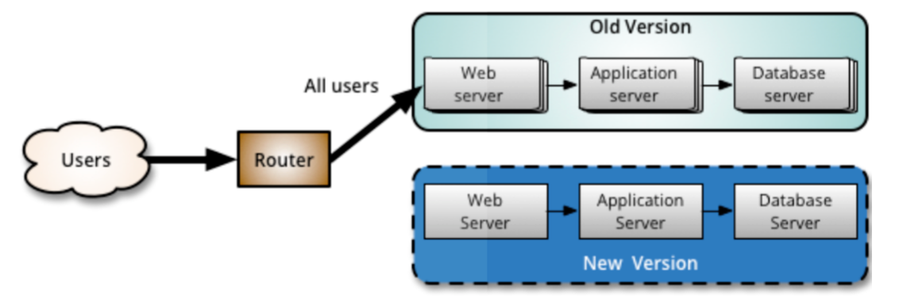
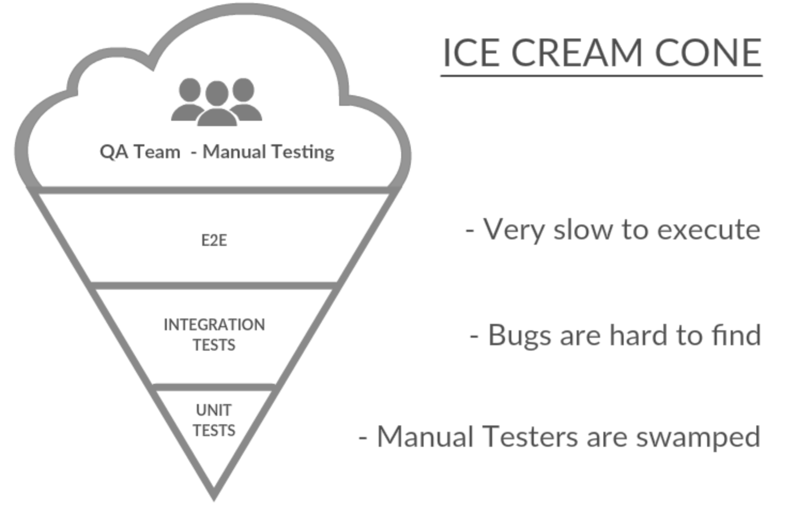
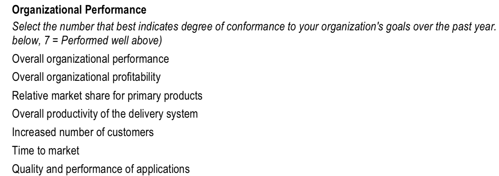

% Ohjelmistotuotanto
% Matti Luukkainen ja ohjaajat Kalle Ilves, Petri Suhonen, Oskari Nuottonen, Tuukka Puonti
% syksy 2022

#

&nbsp;&nbsp;&nbsp;&nbsp;&nbsp;&nbsp;&nbsp;&nbsp;&nbsp;&nbsp;&nbsp;&nbsp;&nbsp;&nbsp;&nbsp;&nbsp;&nbsp;&nbsp;&nbsp;&nbsp;&nbsp;&nbsp;&nbsp;&nbsp;&nbsp;&nbsp;&nbsp;&nbsp;&nbsp;&nbsp;&nbsp;&nbsp;&nbsp;&nbsp;&nbsp;&nbsp;&nbsp;Luento 7

&nbsp;&nbsp;&nbsp;&nbsp;&nbsp;&nbsp;&nbsp;&nbsp;&nbsp;&nbsp;&nbsp;&nbsp;&nbsp;&nbsp;&nbsp;&nbsp;&nbsp;&nbsp;&nbsp;&nbsp;&nbsp;&nbsp;&nbsp;&nbsp;&nbsp;&nbsp;&nbsp;&nbsp;&nbsp;&nbsp;&nbsp;&nbsp;&nbsp;&nbsp;&nbsp;&nbsp;21.11.2022

# Kurssipalaute

- Kurssipalaute
  - Kurssilla lopussa kerättävän palautteen lisäksi ns. jatkuva palaute https://coursefeedback.helsinki.fi

# Ketterien menetelmien testauskäytänteitä

. . .

- Sprintissä toteutettavat storyt integroidaan ja testataan sprintin aikana
  - Sykli ominaisuuden määrittelystä siihen, että se on valmis ja testattu on erittäin lyhyt

. . .

- Automatisointi erittäin tärkeässä roolissa, sillä testejä suoritetaan usein

. . .

- Ideaalitilanteessa testaajia sijoitettu kehittäjätiimiin, myös ohjelmoijat kirjoittavat testejä
  - tiimit _cross functional_ 

# Ketterien menetelmien testauskäytänteitä

. . .

- Test driven development (TDD)
  - Nimestä huolimatta kyseessä toteutus- ja suunnittelutekniikka
  - Sivutuotteena paljon automaattisesti suoritettavia testejä
  - Laskareissa Ostoskori

. . .

- Acceptance Test Driven Development / Behavior Driven Development
  - User storyjen tasolla tapahtuva automatisoitu testaus
  - Robot ja Cucumber

. . .

- Exploratory testing, suomeksi tutkiva testaus
  - Järjestelmätestauksen tekniikka, jossa testaaminen tapahtuu ilman formaalia testaussuunnitelmaa

. . .

- Continuous Integration (CI) eli jatkuva integraatio
  - Perinteisen integraatio- ja integraatiotestausvaiheen korvaava työskentelytapa

# Continuous integration / continuous deployment

- Vaiheet, joiden suorittaminen edellytetään, että commitattu koodi saadaan siirrettyä staging/tuotantoympäristöön

{ width=400 }

. . .

- Trendinä automatisointi ja tuotantiinviennin frekvenssin kasvatus

# Tuotannossa tapahtuva testaaminen ja laadunhallinta

. . .

- Perinteisesti ajateltu: kaikki laadunhallintaan tehdään ennen kuin ohjelmisto / uudet toiminnallisuudet otetaan käyttöön 

{ width=400 }

# Tuotannossa tapahtuva testaaminen ja laadunhallinta

- Perinteisesti ajateltu: kaikki laadunhallintaan tehdään ennen kuin ohjelmisto / uudet toiminnallisuudet otetaan käyttöön 

{ width=400 }


- Viime aikainen trendi on tehdä osa laadunhallinnasta *monitoroimalla* tuotannossa olevaa ohjelmistoa


# Blue-green-deployment

- Kaksi rinnakkaista tuotantoympäristöä: _blue_ ja _green_

. . .

- Vain toinen on ohjelmiston käyttäjien aktiivisessa käytössä
  - edustapalvelin ohjaa käyttäjien liikenteen aktiiviseen ympäristöön

{ width=400 }

. . .

- Uusi ominaisuus viedään ensin passiiviseen ympäristöön

# Blue-green-deployment

- Kaksi rinnakkaista tuotantoympäristöä: _blue_ ja _green_
- Vain toinen on ohjelmiston käyttäjien aktiivisessa käytössä
  - edustapalvelin ohjaa käyttäjien liikenteen aktiiviseen ympäristöön

{ width=400 }


- Uusi ominaisuus deployataan ensin passiiviseen ympäristöön
- ja sitä testataan
  - osa liikenteestä ohjataan aktiivisen lisäksi passiiviseen ympäristöön ja varmistetaan, että toiminta odotettua

#

- Kun uuden ominaisuuden todetaan toimivan, vaihdetaan palvelinten rooli
  - määritellään edustapalvelin ohjaamaan liikenne uudelle palvelimelle

. . .

- Jos vaihdon jälkeen havaitaan ongelmia, tehdään _rollback_
  - vanha versio jälleen aktiiviseksi

. . .

- Testit, tulosten varmistaminen, tuotantoympäristön vaihto ja mahdollinen rollback _tulee automatisoida_

# Canary release

. . .

- _Canary-releasessa_ uuden ominaisuuden sisältävään ympäristöön ohjataan osa järjestelmän käyttäjistä

{ width=400 }

. . .

- Uuden ominaisuuden sisältämää versiota _monitoroidaan_ 
  - jos ei ongelmia  ohjataan kaikki liikenne uuteen versioon

. . .

- Ongelmatilanteissa palautetaan käyttäjät aiempaan, toimivaksi todettuun versioon

#

- Uuden version toimivaksi varmistaminen perustuu järjestelmän _monitorointiin_

. . .

- Esim. sosiaalisen median palvelussa 
  - palvelun muistin ja prosessoriajan kulutusta 
  - verkkoliikenteen määrää 
  - sovelluksen eri sivujen vasteaikoja
  - kirjautuneiden käyttäjien määrää
  - luettujen ja lähetettyjen viestien määriä per käyttäjä
  - kirjautuneen käyttäjän sovelluksessa viettämää aikaa

. . .

- Monitoroidaan palvelimen yleisen toimivuuden lisäksi 
_käyttäjätason metriikoita_ (engl. business level metrics)

. . .

- Jos suuria eroja aiempaan, tehdään rollback edelliseen versioon 
  - esim. kirjautuneet käyttäjät eivät lähetä viestejä samaa määrää kuin keskimäärin normaalisti

. . .

- Testauksen ja kaikkien tuotantoon vientiin liittyvän on syytä tapahtua automatisoidusti

# Tuotannossa testaaminen ja tietokanta

- Erityisesti canary releasejen yhteydessä järjestelmän molemmat versiot käyttävät yleensä samaa tietokantaa

{ width=400 }

. . .

- Asettaa haasteita, jos järjestelmään toteutetut uudet ominaisuudet edellyttävät muutoksia tietokannan skeemaan
  - Tarvitaan yhtä aikaa sekä uutta että vanhaa versiota kannasta

. . .

- Jos versioilla käytössä eri tietokannat, täytyy kantojen tila synkronoida, jotta vaihdos onnistuu saumattomasti

# Feature toggle

- _Feature togglejen_ avulla voidaan canary releaset toteuttaa käyttämällä yhtä tuotantopalvelinta

. . .

- Koodiin laitetaan _ehtolauseita_: osa liikenteestä ohjataan vanhan toteutuksen sijaan testauksen alla olevaan toteutukseen

. . .

- Esim. some-palvelussa feature toggle: _osalle käytetään näytetään uuden algoritmin perusteella generoitu lista uutisia_

```python
def recommended_news_generator(user): 
    if is_in_canary_release(user):
        return experimental_recommendation_algorithm(user)
    else:
        return recommendation_algoritm(user)
```

# Feature togglejen soveltaminen

- Aluksi piilotetaan uusi ominaisuus käyttäjiltä feature toggleilla
  - eli toggle palauttaa vanhan version normaaleille käyttäjille

. . .

- Sovellus kehittäjien mahdollista valita kumman version toggle palauttaa

. . .

- Kun valmiina laajempaan testiin, julkaistaan esim. 
    - ensin kehittäjäyrityksen omaan käyttöön 
    - sitten osalle käyttäjistä canary releasena

. . .

- Lopulta feature toggle ja vanha toteutus voidaan poistaa

# 

- Suuret internetpalvelut soveltavat laajalti canary releaseihin ja feature flageihin perustuvaa kehitysmallia
  - Facebook, Netflix, Google, Flickr, ...
  - Suomessa esim. Veikkaus

{ width=400 }

. . .

- A/B-testaus: arvioidaan onko uusi toteutus parempi kuin vanha

. . .

- Kerrallaan voi olla menossa useita kymmeniä A/B-testattavia eksperimenttejä

# TAUKO 10 min

- jos kello tarpeeksi

# Versionhallinnan käyttötavoista

# Feature branchit

. . .  

- Uusi ominaisuus, esim. user story toteutetaan ensin omaan versionhallinnan haaraansa

{ width=400 }

# Feature branchit

- Uusi ominaisuus, esim. user story toteutetaan ensin omaan versionhallinnan haaraansa

{ width=400 }

  - ja ominaisuuden valmistuttua haara mergetään pääkehityshaaraan

# Feature branchit ja merge hell

- Monet pitävät feature brancheja versionhallinnan _parhaana käytänteenä_

. . .  

- Viime aikoina huomattu, että feature branchit aiheuttavat helposti pahoja merge-konflikteja sprintin lopussa

. . .  

- Seurauksena pienimuotoinen integraatiohelvetti: _merge hell_ 

. . .  

- Martin Fowler kuuluisassa artikkelissa Continuous integration: _Everyone Commits To the Mainline Every Day_

. . .

- Voidaanko edes puhua jatkuvasta integraatiosta jos feature branchit ovat käytössä?

# Branchayskäytänteet

- Toisin kuin aiemmissa versionhallintajärjestelmissä, Gitissä brancien teko on erittäin helppoa

. . .

- Tämä on johtanut mitä monimutkaisiin branchayskäytänteisiin

{ width=400 }

. . .

- Tilanne on alkanut osin jo lähteä lapasesta

# Trunk based development

. . .

- Uusi trendi _trunk based development_: pitkäikäisiä feature brancheja ei käytetä ollenkaan
  - Kaikki koodi suoraan pääkehityshaaraan
  - ... josta käytetään nimitystä _trunk_

. . .

{ width=400 }

# Trunk based development

- Uusi trendi _trunk based development_: pitkäikäisiä feature brancheja ei käytetä ollenkaan
  - Kaikki koodi suoraan pääkehityshaaraan
  - ... josta käytetään nimitystä _trunk_

{ width=400 }

- Ohjelmiston kustakin julkaistusta versiosta saatetaan tehdä oma _release branch_

# Trunk based development
 
- Pakottaa sovelluskehittäjät tekemään pieniä, nopeasti päähaaraan mergettäviä muutoksia

. . .

- Käytetään feature toggleja
  - puolivalmiitakin ominaisuuksia voidaan helposti ohjelmoida päähaaraan ilman toiminnallisuuden rikkomista

. . .

- Edellyttää sovelluskehittäjiltä _todella hyvää_ kuria ja systemaattisuutta

. . .

- Kehitysmallia noudattavat esim. Google, Facebook ja Netflix

# Trunk based development

_How GitHub uses GitHub to build GitHub_ 2012

. . .


_Build features fast. Ship them. That's what we try to do at GitHub. Our process is the anti-process: **what's the minimum overhead we can put up with to keep our code quality high**, all while building features as quickly as possible? It's not just features, either: faster development means happier_ 

# TAUKO 10 min

- viimeistään nyt

# Dev vs Ops

- Jatkuva toimittaminen ja toimitusvalmius (CD) sekä tuotannossa testaaminen on haastavaa

. . .

- Perinteisesti tarkka erottelu _sovelluskehittäjien_ (developers, dev) ja _ylläpitäjien_ (operations, ops) välillä
  - yleistä että sovelluskehittäjät eivät pääse kirjautumaan tuotantopalvelimille 
  - tuotantoon vieminen ja tietokantaan skeeman päivitykset tapahtuvat ylläpitäjien toimesta

. . .

- Jos näin on, tuotantopalvelimelle pystytään viemään uusia versioita vain harvoin, esim 4 kertaa vuodessa

. . .

- Joustavammat toimintamallit vaativat kulttuurinmuutoksen

. . .

- Kehittäjien (dev) ja ylläpidon (ops) työskenneltävä yhdessä
  - Sovelluskehittäjille tulee antaa tarvittava pääsy tuotantopalvelimelle 
  - Scrum-tiimiin sijoitetaan ylläpitovastuilla olevia ihmisiä

# DevOps

- _DevOps_: toimintamalli missä dev ja ops työskentelevät tiiviisti yhdessä 

. . .

- DevOps on hypetermi, jonka merkitys osin epäselvä
  - työpaikkailmoituksissa voidaan arvostaa DevOps-taitoja 
  - tai etsiä ihmistä DevOps-tiimiin
  - myynnissä mitä erilaisempia DevOps-työkaluja

. . .

- Suurin osa järkevistä määritelmistä tarkoittaa DevOpsilla _kehittäjien ja järjestelmäylläpidon yhteistä työnteon tapaa_, ja sen takia onkin hyvä puhua DevOps-kulttuurista

. . .

- Työkaluja/asioita jotka liittyvät DevOpsiin:
  - automatisoitu testaus
  - jatkuva integraatio ja toimittaminen (CI/CD)
  - virtualisointi ja kontainerisointi (Docker)
  - infrastructure as code
  - pilvipalveluna toimivat palvelimet ja sovellusympäristöt (PaaS, IaaS, SaaS)

#

- Monet listatuista kehittyneet viimeisen 5-10 vuoden aikana ja mahdollistaneet DevOpsin helpomman soveltamisen

. . .

- Eräs tärkeimmistä DevOpsia mahdollistavista asioista _infrastructure as code_
  - fyysisten palvelinten sijaan virtuaalisia ja pilvessä toimivia palvelimia, joita voi konfiguroida ohjelmallisesti

. . .

- Raudastakin on tullut "koodia"
  - palvelinten konfiguraatioita voidaan tallettaa versionhallintaan ja jopa testata
  - sovelluskehitys ja ylläpito ovat alkaneet muistuttaa toisiaan 

. . .

- Työkalujen käyttöönotto ei riitä, DevOpsin "tekeminen" lähtee kulttuurisista tekijöistä, tiimirakenteista, sekä asioiden sallimisesta


#

{ width=400 }

#

{ width=400 }

#

{ width=400 }

# DevOps: ketteryys laajennettuna

. . .

- Scrumin ja ketterän eräs tärkeimmistä periaatteista on tehdä kehitystiimeistä itseorganisoituvia ja "cross functional" 
  
. . .

- DevOps on keino viedä ketteryyttä askeleen pitemmälle
  - Mahdollistaa että kehitystiimi pystyy viemään vaivattomasti uudet toiminnallisuudet tuotantoympäristöön 
  - ja jopa testaamaan sekä operoimaan niitä tuotannossa

. . .

- DevOps siis laajentaa ketteryyden koskemaan myös järjestelmäylläpitoa

. . .

- DevOps-ajattelutapa asettaa sovelluskehittäjille lisää osaamisvaatimuksia

  - kehittäjien pitää hallita enenevissä määrin ylläpitoasioita

# 13.3.2023-

{ width=400 }

- https://devopswithdocker.com/ by Jami Kousa

# Yhteenveto - ketterän testauksen nelikettä

. . .

{ width=400 }

# Yhteenveto - ketterän testauksen nelikettä

- Business facing vs. technology facing
  - Testataanko käyttäjän kokemaa toiminnallisuutta vai ohjelmiston teknisiä ominaisuuksia

  . . .

- Supporting team vs. critique to the product
  - Onko testaus sovelluskehittäjien tukena vai tuotteen laatua varmistamassa

. . .

- Eri tyyppiset testit suurelta osin automatisoitavissa
  - Poikkeuksena _tutkiva testaaminen_ ja _käyttäjän hyväksymätestaus_ edellyttävät maniaalista työtä

. . .

- Kaikilla neljänneksillä on oma roolinsa 
  - tilanteesta riippuu missä suhteessa laadunhallinnan resurssit kannattaa kuhunkin neljännekseen kohdentaa

# Loppupäätelmiä testauksesta

. . .

- Ketterissä menetelmissä kantavana teemana on _arvon tuottaminen asiakkaalle_
  - Sopii ohjeeksi myös arvioitaessa testauksen laajuutta
  - Testauksella ei ole itseisarvoista merkitystä
  - Testaamattomuus alkaa pian heikentää tuotteen laatua liikaa

. . .

- Testausta ja laadunhallintaa on tehtävä paljon ja toistuvasti eli automatisointi on yleensä pidemmällä tähtäimellä kannattavaa

. . .

- Automatisointi ei ole halpaa eikä helppoa
  - Väärin, väärään aikaan tai väärälle tasolle tehdyt automatisoidut testit voivat tuottaa enemmän harmia ja kustannuksia kuin hyötyä

#

- Jos ohjelmistossa komponentteja, jotka tullaan ehkä poistamaan tai korvaamaan pian, ei niiden testejä kannata automatisoida
  -  esim. jos kyseessä *minimal viable product*

. . .

- Väliaikaiseksi tarkoitettu komponentti voi jäädä järjestelmään vuosiksi...

. . .

- Kokonaan uutta ohjelmistoa tai komponenttia tehtäessä kannattaa ohjelman rakenteen ensin antaa stabiloitua, kattavammat testit vasta myöhemmin

. . .

- _Testattavuus_ tulee pitää koko ajan mielessä 

#

- Oppikirjamääritelmän mukaista TDD:tä sovelletaan harvoin
  - Välillä TDD hyödyllinen, esim. testattaessa rajapintoja, joita käyttäviä komponentteja ei ole vielä olemassa
  - Testit tekee samalla vaivalla kuin "pääohjelman"

. . .

- Kattavien yksikkötestien tekeminen ei yleensä ole mielekästä ohjelman kaikille luokille

. . .

- Yksikkötestaus hyödyllisimmillään kompleksia logiikkaa sisältäviä luokkia testattaessa

. . .

- Mielummin integraatiotason testejä ohjelman isompien komponenttien rajapintoja vasten
  - Pysyvät todennäköisemmin valideina komponenttien sisäisen rakenteen muuttuessa


# 

- Automaattisia testejä kannattaa tehdä etenkin niiden komponenttien rajapintoihin, joita muokataan usein

. . .

- Käyttöliittymän läpi suoritettavat, käyttäjän interaktiota simuloivat testit usein hyödyllisimpiä
  - Liian aikaisin tehtynä ne saattavat aiheuttaa kohtuuttoman paljon ylläpitovaivaa

#

- Testitapauksista kannattaa aina tehdä todellisia käyttöskenaarioita vastaavia
  - Pelkkiä testauskattavuutta kasvattavia testejä on turha tehdä

. . .

- Erityisesti järjestelmätason testeissä kannattaa käyttää mahdollisimman oikeanlaista dataa 
  - Koodissa hajoaa aina jotain kun käytetään oikeaa dataa riippumatta siitä miten hyvin testaus on suoritettu

. . .

- Parasta on jos staging-ympäristössä on käytössä sama _data kuin_  tuotantoympäristössä

#

- Ehdottomasti kaikkein tärkein laadunhallinnan kannalta on **mahdollisimman usein tapahtuva käyttöönotto**
  - edellyttää hyvin rakennettua deployment pipelineä, kohtuullista testauksen automatisointia 

. . .

- Trunk based development auttaa nopeaa käyttöönottoa feature brancheihin verrattuna

. . .

- Suosittelen että käyttöönotto tapahtuu niin usein kuin mahdollista, jopa useita kertoja päivässä
  - takaa sen, että pahoja integrointiongelmia ei synny
  - sovellukseen syntyvät regressiot havaitaan ja pystytään korjaamaan mahdollisimman nopeasti

. . .

- Nopea käyttöönotto **pakottaa** laatuun

# Testauspyramiidi

- Oma näkemykseni poikkeaa jossain määrin ns _testauspyramidista_

{ width=300 }

. . .

- DISA: 570 yksikkötestiä, ja kaikki vihreällä. Softa ei edes käynnisty...

# Guilermo Rauch

 { width=300 }

# Kent Dodds

{ width=300 }
 
# Testausjäätelö

- On oltava varuillaan että ei synnytetä _testausjäätelöä_

{ width=350 }

. . .

- Jälkikäteen yleensä helppo sanoa miten olisi kannattanut testata...

# Tieteellinen evidenssi

. . .

- Edellä esitellyistä ohjelmistojen käyttöönoton ja laadunhallinnan käytenteiden toimivuudesta on runsaasti anekdotaalista evidenssiä

. . . 

- Accelerate: _The Science of Lean Software and DevOps: Building and Scaling High Performing Technology Organizations_ 2018

. . .

{ width=380 }

# Tieteellinen evidenssi

- Edellä esitellyistä julkaisun ja laadunhallinnan käytenteiden toimivuudesta on paljon runsaasti anekdotaalista evidenssiä

- Accelerate: _The Science of Lean Software and DevOps: Building and Scaling High Performing Technology Organizations_ 2018

{ width=380 }

# Tieteellinen evidenssi

- Edellä esitellyistä julkaisun ja laadunhallinnan käytenteiden toimivuudesta on paljon runsaasti anekdotaalista evidenssiä

- Accelerate: _The Science of Lean Software and DevOps: Building and Scaling High Performing Technology Organizations_ 2018

{ width=380 }

# The Science of Lean Software and DevOps

- Tutkimus tehty 2013-2017, perustuu yli 20000 tuhanteen kyselytutkimuksen vastaukseen
  - Julkaistu kirjan lisäksi vertaisarvioituina tieteellisinä julkaisuinta

. . .

{ width=500 }

#

# The Science of Lean Software and DevOps

Tutkimus laajentunut ja identifioi 24 avain "taitoa" (capabilities) jotka vaikuttavat positiivisesti organisaatioiden tehokkuuteen


{ width=300 }