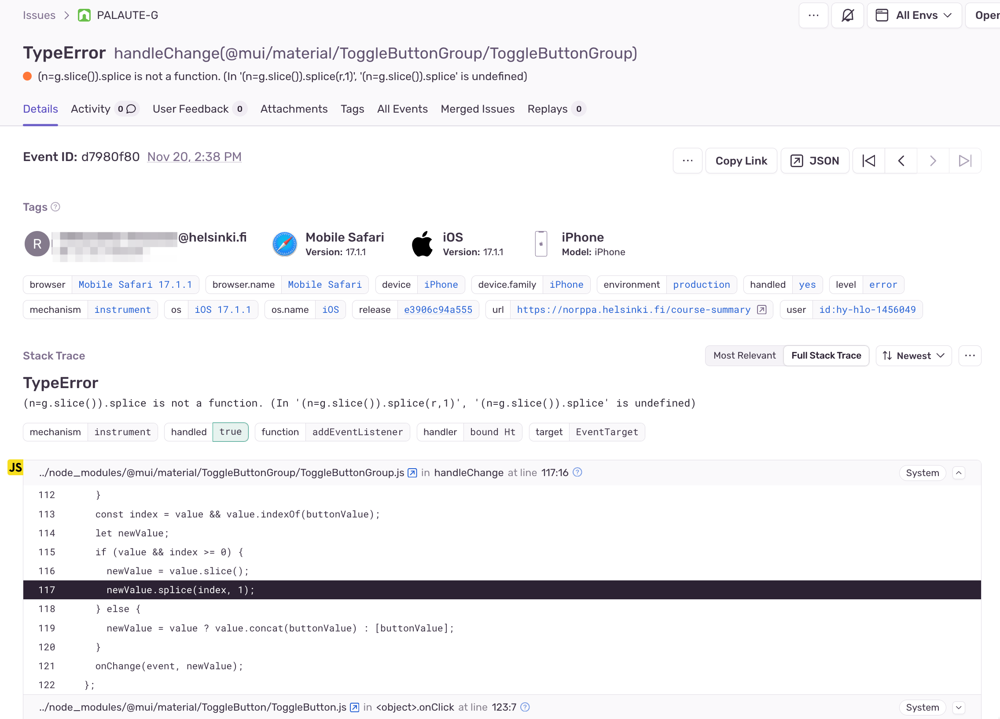

% Ohjelmistotuotanto
% Matti Luukkainen ja ohjaajat Valtteri Kantanen, Hannah Leinson, Riku Rauhala, Ville Saastamoinen
% syksy 2023

#

&nbsp;&nbsp;&nbsp;&nbsp;&nbsp;&nbsp;&nbsp;&nbsp;&nbsp;&nbsp;&nbsp;&nbsp;&nbsp;&nbsp;&nbsp;&nbsp;&nbsp;&nbsp;&nbsp;&nbsp;&nbsp;&nbsp;&nbsp;&nbsp;&nbsp;&nbsp;&nbsp;&nbsp;&nbsp;&nbsp;&nbsp;&nbsp;&nbsp;&nbsp;&nbsp;&nbsp;&nbsp;Luento 8

&nbsp;&nbsp;&nbsp;&nbsp;&nbsp;&nbsp;&nbsp;&nbsp;&nbsp;&nbsp;&nbsp;&nbsp;&nbsp;&nbsp;&nbsp;&nbsp;&nbsp;&nbsp;&nbsp;&nbsp;&nbsp;&nbsp;&nbsp;&nbsp;&nbsp;&nbsp;&nbsp;&nbsp;&nbsp;&nbsp;&nbsp;&nbsp;&nbsp;&nbsp;&nbsp;&nbsp;21.11.2023

# Kurssipalaute

- Kurssipalaute
  - Kurssilla lopussa kerättävän palautteen lisäksi ns. jatkuva palaute https://norppa.helsinki.fi

# Ohjelmiston elinkaaren vaiheet

- Riippumatta tyylistä ja tavasta jolla ohjelmisto tehdään, ohjelmistojen tekemiseen kuuluu
  - vaatimusten analysointi ja määrittely 
  - **suunnittelu**
  - **toteutus**
  - testaus/laadunhallinta
  - ohjelmiston ylläpito

. . .

- Jakautuu kahteen vaiheeseen:
  - arkkitehtuurisuunnittelu
  - olio/komponenttisuunnittelu

. . .

- Näiden lisäksi UI/UX-suunnittelu

# Arkkitehtuurityyli

- Ohjelmiston arkkitehtuuri perustuu yleensä yhteen tai useampaan **arkkitehtuurityyliin** (architectural style)
  - hyväksi havaittua tapaa strukturoida tietyntyyppisiä sovelluksia

- Tyylejä suuri määrä
  - Kerrosarkkitehtuuri
  - Mikropalveluarkkitehtuuri
  - MVC
  - Pipes-and-filters
  - Repository
  - Client-server
  - Publish-subscribe
  - Event driven
  - REST
  - ...

# Kurssipalautejärjestelmä Norppa

- Kerrosarkkitehtuuri
- Mikropalvelu
- Publish subscribe / Event driven

#

{ width=400 }

#

{ width=400 }

#

{ width=400 }

#

{ width=400 }

#

{ width=400 }

# Arkkitehtuurin kuvaamisesta

- On tilanteita, missä sovelluksen arkkitehtuuri on dokumentoitava jollain tavalla

. . .

- Arkkitehtuurien kuvaamiselle ei olemassa vakiintunutta formaattia
  - UML:n luokka- ja pakkauskaaviot sekä komponentti- ja sijoittelukaaviot joskus käyttökelpoisia 
  - Useimmiten käytetään epäformaaleja laatikko/nuoli-kaavioita

# UML komponenttikaavio

{ width=400 }

# Laatikko ja nuoli  -kaavio

{ width=400 }

# Hienompi laatikko ja nuoli  -kaavio

{ width=400 }

# Arkkitehtuurin kuvaamisesta

- Arkkitehtuurikuvaus kannattaa tehdä useasta eri tarpeita palvelevasta _näkökulmasta_
  - korkean tason kuvauksen voi olla hyödyksi esim. vaatimusmäärittelyssä 
  - tarkemmat kuvaukset toimivat ohjeena tarkemmassa suunnittelussa ja ylläpitovaiheen aikaisessa laajentamisessa

. . .  

-  Hyödyllinen arkkitehtuurikuvaus dokumentoi ja perustelee tehtyjä _arkkitehtuurisia valintoja_

# Arkkitehtuuri ketterissä menetelmissä

. . .

- Ketterien menetelmien kantava teema on toimivan, asiakkaalle arvoa tuottavan ohjelmiston nopea toimittaminen

. . .

- Periaatteita
  - _Our highest priority is to satisfy the customer through early and continuous delivery of valuable software_
  - _Deliver working software frequently..._

. . .

- Ketterät menetelmät suosivat yksinkertaisuutta
  - _Simplicity, the art of maximizing the amount of work not done, is essential_

. . .

- Arkkitehtuuriin suunnittelu ja dokumentointi on perinteisesti pitkäkestoinen, ohjelmoinnin aloittamista edeltävä vaihe

. . .

- Ketterät menetelmät ja "arkkitehtuurivetoinen" ohjelmistotuotanto siis jossain määrin ristiriidassa

# Arkkitehtuuri ketterissä menetelmissä 

- Ketterien menetelmien yhteydessä puhutaan _inkrementaalisesta suunnittelusta ja arkkitehtuurista_

. . .

- Arkkitehtuuri mietitään riittävällä tasolla projektin alussa
  - Jotkut projektit alkavat ns. nollasprintillä ja alustava arkkitehtuuri määritellään tällöin

. . .

- Ohjelmiston "lopullinen" arkkitehtuuri muodostuu iteraatio iteraatiolta samalla kun uutta toiminnallisuutta toteutetaan 

. . .

- Esim. kerrosarkkitehtuurin mukaista sovellusta ei rakenneta "kerros kerrallaan"
  - Jokaisessa iteraatiossa tehdään pieni pala jokaista kerrosta, sen verran kuin iteraation tavoitteiden toteuttaminen edellyttää

# Ankrementaalinen arkkitehtuuri

- Alussa ns. _walking skeleton_
  - sisältää tynkäversiot ohjelmiston komponenttirakenteesta

{ width=120 }

. . .

- Rakennetaan skeletonin varaan tuotetta story storyltä

# Ominaisuuksiin perustuva integraatio

- Alussa ns. _walking skeleton_
  - sisältää tynkäversiot ohjelmiston komponenttirakenteesta

{ width=120 }

- Rakennetaan skeletonin varaan tuotetta story storyltä

# Ominaisuuksiin perustuva integraatio

- Alussa ns. _walking skeleton_
  - sisältää tynkäversiot ohjelmiston komponenttirakenteesta

{ width=120 }

- Rakennetaan skeletonin varaan tuotetta story storyltä

# Ominaisuuksiin perustuva integraatio

- Alussa ns. _walking skeleton_
  - sisältää tynkäversiot ohjelmiston komponenttirakenteesta

{ width=120 }

- Rakennetaan skeletonin varaan tuotetta story storyltä

# Arkkitehtuuri ketterissä menetelmissä

- Perinteisesti arkkitehtuurin luonut *ohjelmistoarkkitehti*
  - ohjelmoijat velvoitettuja noudattamaan arkkitehtuuria

. . .

- Ketterissä menetelmissä ei suosita erillistä arkkitehdin roolia
  - Scrumissa kaikista tiimiläisistä käytetään nimikettä developer

. . .

- Ketterä idealli: kehitystiimi luo arkkitehtuurin yhdessä
  - _The best architectures, requirements, and designs emerge from self-organizing teams_

. . .

- **Arkkitehtuuri koodin tapaan tiimin yhteisomistama**

. . .

- Etuja:
  - kehittäjät sitoutuvat paremmin arkkitehtuurin noudattamiseen kuin "norsunluutornissa" olevan arkkitehdin määrittelemään
  - dokumentaatio voi olla kevyt, tiimi tuntee arkkitehtuurin hengen ja pystyy sitä noudattamaan

# Inkrementaalinen arkkitehtuuri: edut ja riskit

- Oletus: optimaalista arkkitehtuuria ei pystytä suunnittelemaan projektin alussa, kun vaatimuksia, toimintaympäristöä ja toteutusteknologioita ei tunneta
  - Jo tehtyjä arkkitehtuuriratkaisuja muutetaan tarvittaessa

. . .

- Kuten vaatimusmäärittelyssä, myös arkkitehtuurin suunnittelussa ketterä pyrkii _välttämään liian aikaisin tehtävää, myöhemmin ehkä turhaksi osoittautuvaa työtä_

. . .

- Inkrementaalinen arkkitehtuuri edellyttää koodilta hyvää sisäistä laatua ja kehittäjiltä kurinalaisuutta
  - muuten seurauksena on kaaos

# TAUKO 10 min

# Olio/komponenttisuunnittelu

. . .

- Sovelluksen arkkitehtuuri antaa raamit, jotka ohjaavat sovelluksen tarkempaa suunnittelua ja toteuttamista

. . .

- _Olio- tai komponenttisuunnittelu_
  - tarkentaa arkkitehtuuristen komponenttien väliset rajapinnat sekä hahmottelee ohjelman luokka- tai moduulirakenteen

. . .   

- Vesiputousmallissa komponenttisuunnittelu tehty ennen ohjelmointia ja  dokumentoitu tarkkaan esim. UML:lä

. . .

- Ketterässä tarkka suunnittelu tehdään vasta ohjelmoitaessa

. . .

- Suunnittelussa pyritään maksimoimaan _koodin sisäinen laatu_ 
  - helppo ylläpidettävyys ja laajennettavuus 

. . .

- Ohjelmistosuunnittelu on "enemmän taidetta kuin tiedettä", kokemus ja hyvien käytänteiden tuntemus auttaa
  - kehitetty monia suunnittelumenetelmiä, mikään niistä ei ole vakiintunut

# Laadukas koodi

- Tavoitteena siis **sisäiseltä laadultaan** hyvä koodi

. . .

- _Sisäinen laatu_ (internal quality)
  - onko virheiden jäljitys ja korjaaminen helppoa
  - onko koodia helppo laajentaa ja jatkokehittää
  - pystytäänkö koodin toiminnallisuuden oikeellisuus varmistamaan muutoksia tehtäessä

. . .

- Jos sisäinen laatu rapistuu
  - alkaa vaikuttamaan myös ulkoiseen eli käyttäjän kokemaan laatuun
  - kehitystiimin velositeetti alkaa tippua

# Laadukkaan koodin tuntomerkkejä

. . .

- Laadukkaalla koodilla joukko yhteneviä ominaisuuksia, tai _laatuattribuutteja_, esim. seuraavat:
  - kapselointi
  - korkea koheesion aste
  - riippuvuuksien vähäisyys 
  - toisteettomuus
  - testattavuus
  - selkeys

. . .

- _Suunnittelumallit_ auttavat luomaan koodia, joissa sisäinen laatu kunnossa
  - kurssin aikana nähty jo _dependency injection_, _repository_
  - lisää kurssimateriaalissa ja laskareissa

# Koodin laatuattribuutti: kapselointi

. . .  

- _Kapselointi_ ohjelmoinnin peruskursseilla: 
  - _oliomuuttujat tulee määritellä piilotetuksi ja niille tulee tehdä tarvittaessa aksessorimetodit_

. . .

- Olion sisäisen tilan lisäksi kapseloinnin kohde voi olla mm. _käytettävän olion tyyppi, käytetty algoritmi, olioiden luomisen tapa, käytettävän komponentin rakenne_

. . .

- Näkyy myös arkkitehtuurin tasolla
  - kerrosarkkitehtuuri: ylempi kerros käyttää ainoastaan alemman kerroksen ulospäin tarjoamaa rajapintaa, muu kapseloitu
  - mikropalvelut: yksittäinen palvelu kapseloi sisäisen logiikan, tiedon säilytystavan ja tarjoaa ainoastaan verkon välityksellä käytettävän rajapinnan

# Koodin laatuattribuutti: koheesio

. . .  

- _Koheesio_:
  - kuinka pitkälle metodin, luokan tai komponentin koodi keskittyy tietyn yksittäisen toiminnallisuuden toteuttamiseen
  - hyvänä pidetään mahdollisimman korkeaa koheesion astetta

. . .

- Luokkatason koheesio
  - luokan _vastuulla_ vain yksi asia, tunnetaan myös nimellä _single responsibility principle_

. . .

- Arkkitehtuurin tasolla
  - kerrosarkkitehtuurin kerrokset samalla abstraktiotasolla, esim. käyttöliittymä tai tietokantarajapinta
  - mikropalvelu toteuttaa tiettyyn liiketoiminnan tason toiminnallisuuden, esim. suosittelualgoritmin tai käyttäjien hallinnan

# Metoditason koheesio

{ width=400 }

# Metoditason koheesio

{ width=400 }

- metodi tekee kolmea eri asiaa, jotka eri abstraktiotasolla

# Metoditason koheesio

{ width=420 }

# Luokkatason koheesio

- Single responisibility -periaate: _luokalla yksi syy muuttua_

. . .

{ width=400 }

# Luokkatason koheesio

{ width=400 }

. . .

- *delegoidaan osa vastuista* eri luokalle

# Koodin laatuattribuutti: riippuvuuksien vähäisyys

. . .  

- Pyrkimys korkeaan koheesioon johtaa ohjelmiin, joissa suuri määrä olioita/komponentteja

. . .  

- Olioiden oltava keskenään vuorovaikutuksessa toteuttaakseen ohjelman toiminnallisuuden: _paljon keskinäisiä riippuvuuksia_

. . .  

- _Riippuvuuksien vähäisyyden_ periaate
  - eliminoidaan _tarpeettomat_ riippuvuudet
  - sekä riippuvuudet konkreettisiin asioihin

. . .
 
- Hyödynnetään _dependence injection_ -suunnittelumallia

# Koodin laatuattribuutti: riippuvuuksien vähäisyys

{ width=400 }

# Koodin laatuattribuutti: toisteettomuus

. . .  

- Aloittelevaa ohjelmoijaa pelotellaan toisteisuuden vaaroista uran ensiaskelista alkaen: älä copypastaa koodia!

. . .

- Alan piireissä toisteisuudesta varoittava periaate kulkee nimellä DRY, don't repeat yourself
  - _every piece of knowledge must have a single, unambiguous, authoritative representation within a system_

. . .

- Koodin lisäksi periaate ulottuu koskemaan järjestelmän muitakin osia
  - tietokantaskeemaa, testejä, build-skriptejä

. . .

- Suoraviivainen copypaste helppo eliminoida metodien avulla
  - kaikki toisteisuus ei ole yhtä ilmeistä, monissa suunnittelumalleissa kyse hienovaraisempien toisteisuuden muotojen eliminoinnista

. . .

- Hyvä vs. paha copypaste
  - _three strikes and you refactor_

# Koodin laatuattribuutti: testattavuus

. . .  

- Laadukas koodi on helppo testata kattavasti yksikkö- ja integraatiotestein
  - seuraa yleensä siitä, että koodi koostuu löyhästi kytketyistä, selkeän vastuun omaavista komponenteista

. . .

- Hyvää testattavuutta auttaa turhien riippuvuuksien eliminointi dependency injection -periaatteen avulla

. . .

- Test driven development tuottaa varmuudella hyvin testattavissa olevaa koodia

# Koodin laatuattribuutti: selkeys ja luettavuus

- Perinteisesti ajateltu että koodi kryptistä ja vaikeasti luettavaa
  - yleistä C-kielessä, pyritty esim. optimoimaan tehokkuutta ja muistinkäyttöä

. . .

- Nykytrendi: tehdän koodia, joka nimeämisen sekä rakenteen kautta ilmaisee hyvin sen, mitä koodi tekee

. . .

- Miksi selkeä koodi on tärkeää?
  - joidenkin arvioiden mukaan jopa 90% "ohjelmointiin" kuluvasta ajasta menee olemassa olevan koodin lukemiseen
  - oma aikoinaan niin selkeä koodi, ei enää olekaan yhtä selkeää parin kuukauden kuluttua

# Code smell

- Koodi ei ole aina hyvää...

. . .

- Martin Fowlerin mukaan 
  - _koodihaju_ (code smell) on helposti huomattava merkki siitä että koodissa on jotain pielessä
  - jopa aloitteleva ohjelmoija saattaa pystyä havaitsemaan koodihajun
  - sen takana oleva todellinen syy voi olla jossain syvemmällä 

. . .

- Koodihaju siis kertoo, että syystä tai toisesta _koodin sisäinen laatu_ ei ole parhaalla mahdollisella tasolla

# Koodihajuja 

- Koodihajuja on hyvin monenlaisia ja monentasoisia
- Esimerkkejä helposti tunnistettavista hajuista:
  - toisteinen koodi
  - liian pitkät metodit
  - luokat joissa on liikaa oliomuuttujia
  - luokat joissa on liikaa koodia
  - metodien liian pitkät parametrilistat
  - epäselkeät muuttujien, metodien tai luokkien nimet
  - kommentit

. . .

- Pari monimutkaisempaa
  - Primitive obsession
  - Shotgun surgery

# Refaktorointi

. . .

- Lääke koodin sisäisen laadun ongelmiin on _refaktorointi_  
  - koodin toiminnalisuuden ennallaan pitävä sisäisen rakenteen muutos
  
. . .

- Koodin rakennetta parantavia refaktorointeja on lukuisia, mm.
  - _rename variable/method/class_
  - _extract method_ 
  - _move field/method_ 
  - _extract superclass_ 

. . .

- Osa pystytään tekemään sovelluskehitysympäristön avustamana
  - helpompaa staattisesti tyypitetyillä kielillä kuten Java

# Miten refaktorointi kannattaa tehdä

- Refaktoroinnin edellytys on kattavien testien olemassaolo

. . .

- Kannattaa ehdottomasti edetä pienin askelin
  - yksi hallittu muutos kerrallaan
  - testit suoritettava mahdollisimman usein 

. . .

- Refaktorointia kannattaa suorittaa lähes jatkuvasti
  - pitää koodin rakenteen selkeänä ja helpottaa sekä nopeuttaa koodin laajentamista

. . .

- Osa refaktoroinnista on helppoa ja suoraviivaista, aina ei näin ole
  - joskus tarve tehdä isoja, jopa viikkojen kestoisia refaktorointeja joissa ohjelman rakenne muuttuu paljon

# Refaktorointi tärkeä osa Test driven development -menetelmää

{ width=340 }

1. Kirjoitetaan sen verran testiä että testi ei mene läpi
2. Kirjoitetaan koodia sen verran, että testi menee läpi
3. **Jos huomataan koodin rakenteen menneen huonoksi refaktoroidaan koodin rakenne paremmaksi**
4. Jatketaan askeleesta 1

# 15.1.2024-

Avoin yliopisto: Test-Driven Development 4 + 1 cr

{ width=340 }

- Esko Luontola Nitor (Suomen johtava TDD-asiantuntija)

# Tekninen velka

. . .

- Koodi ei ole aina laadultaan optimaalista

. . .

- Huonoa suunnittelua tai/ja ohjelmointia kuvaa käsite _tekninen velka_ (technical debt)

. . .

- Piittaamattomalla ja laiskalla ohjelmoinnilla/suunnittelulla saadaan ehkä nopeasti aikaan jotain
  - hätäinen ratkaisu tullaan maksamaan korkoineen takaisin _jos_ ohjelmaa on tarkoitus laajentaa

. . .

- Jos korkojen maksun aikaa ei koskaan tule, voi "huono koodi" olla asiakkaan etu
  - esim. minimal viable product (MVP) 

. . .

- Tekninen velka voi olla järkevää tai jopa välttämätöntä
  - voidaan saada tuote nopeammin markkinoille tekemällä tietoisesti huonoa designia, joka korjataan myöhemmin

#

- Kaikki tekninen velka ei samanlaista, taustalla voi olla 
  - holtittomuus, osaamattomuus, tietämättömyys tai tarkoituksella tehty päätös

. . .

- Martin Fowler jaottelee teknisen velan neljään eri luokkaan:
  - Reckless and deliberate: "we do not have time for design" 
  - Reckless and inadverent: "what is layering"?
  - Prudent and inadverent: "now we know how we should have done it"
  - **Prudent and deliberate: "we must ship now and will deal with consequences"**

. . .

- Joskus tekninen velka pakottaa koodaamaan koko järjestelmän uudelleen

# Ohjelmiston elinkaaren vaiheet

. . .

- Riippumatta tyylistä ja tavasta jolla ohjelmisto tehdään, ohjelmistojen tekemiseen kuuluu
  - vaatimusten analysointi ja määrittely 
  - suunnittelu
  - toteutus
  - testaus/laadunhallinta
  - **ohjelmiston ylläpito**

. . .

- Ohjelmistot ovat suurimman osan elinajastaan ylläpitovaiheessa

. . .

- Jos ensimmäinen versio julkaistaan nopeasti, ovat ketterät ohjelmistoprojektit "jatkuvassa" ylläpitovaiheessa

# Muutama ylläpitovaiheen kannalta oleellinen asia

- Backupit

. . .

- Sovelluksen lokit
- Analytiikka  
- Virheiden monitorointi

# Sovelluksen lokit

- Sovellusten tulee tulostaa lokiviestejä erilaisista mielenkiintoisista tilanteista

{ width=350 }

# Sovelluksen lokit: Graylog

- Sovellusten lokit tulee kerätä paikkaan, mistä niitä helppo tarkastella

{ width=350 }

# Analytiikka: Grafana

- Lokeja voidaan hyödyntää erilaiseen analytiikkaan

{ width=350 }

# Virheiden monitoriointi: Sentry

- Virhetilanteista voidaan muodostaa hälyytyksiä

{ width=350 }

# Virheiden monitoriointi: Sentry

{ width=350 }

# Loppupäätelmiä testauksesta

. . .

- Ketterissä menetelmissä kantavana teemana on _arvon tuottaminen asiakkaalle_
  - Sopii ohjeeksi myös arvioitaessa testauksen laajuutta
  - Testauksella ei ole itseisarvoista merkitystä
  - Testaamattomuus alkaa pian heikentää tuotteen laatua liikaa

. . .

- Testausta ja laadunhallintaa on tehtävä paljon ja toistuvasti 
  - automatisointi on yleensä pidemmällä tähtäimellä kannattavaa

. . .

- Automatisointi ei ole halpaa eikä helppoa
  - Väärin, väärään aikaan tai väärälle tasolle tehdyt automatisoidut testit voivat tuottaa enemmän harmia ja kustannuksia kuin hyötyä

#

- Jos ohjelmistossa komponentteja, jotka tullaan poistamaan tai korvaamaan, ei niiden testejä kannata automatisoida
  -  esim. jos kyseessä *minimal viable product*

. . .

- Väliaikaiseksi tarkoitettu komponentti voi jäädä järjestelmään vuosiksi...

. . .

- Aluksi kannattaa ohjelman rakenteen ensin antaa stabiloitua, kattavammat testit vasta myöhemmin

. . .

- _Testattavuus_ tulee pitää koko ajan mielessä 

#

- Kattavien yksikkötestien tekeminen ei yleensä ole mielekästä ohjelman kaikille luokille

. . .

- Yksikkötestaus hyödyllisimmillään kompleksia logiikkaa sisältäviä luokkia testattaessa

. . .

- Mielummin integraatiotason testejä ohjelman isompien komponenttien rajapintoja vasten
  - Pysyvät todennäköisemmin valideina komponenttien sisäisen rakenteen muuttuessa

. . .

- Käyttöliittymän läpi suoritettavat, käyttäjän interaktiota simuloivat testit usein hyödyllisimpiä
  - Liian aikaisin tehtynä ne saattavat aiheuttaa kohtuuttoman paljon ylläpitovaivaa

#

- Testitapauksista kannattaa aina tehdä todellisia käyttöskenaarioita vastaavia
  - Pelkkiä testauskattavuutta kasvattavia testejä on turha tehdä

. . .

- Erityisesti järjestelmätason testeissä kannattaa käyttää mahdollisimman oikeanlaista dataa 
  - Koodissa hajoaa aina jotain kun käytetään oikeaa dataa riippumatta siitä miten hyvin testaus on suoritettu

. . .

- Parasta on jos staging-ympäristössä on käytössä sama _data kuin_  tuotantoympäristössä

#

- Ehdottomasti kaikkein tärkein laadunhallinnan kannalta on **mahdollisimman usein tapahtuva käyttöönotto**
  - edellyttää hyvin rakennettua deployment pipelineä, kohtuullista testauksen automatisointia 

. . .

- Trunk based development auttaa nopeaa käyttöönottoa feature brancheihin verrattuna

. . .

- Suosittelen että käyttöönotto tapahtuu niin usein kuin mahdollista, jopa useita kertoja päivässä
  - takaa sen, että pahoja integrointiongelmia ei synny
  - sovellukseen syntyvät regressiot havaitaan ja pystytään korjaamaan mahdollisimman nopeasti

. . .

- Nopea käyttöönotto **pakottaa** laatuun

# Testauspyramiidi

- Oma näkemykseni poikkeaa jossain määrin ns _testauspyramidista_

{ width=300 }

. . .

- DISA: 570 yksikkötestiä, ja kaikki vihreällä. Softa ei edes käynnisty...

# Guilermo Rauch

 { width=300 }

# Kent Dodds: testauspokaali

{ width=300 }
 
